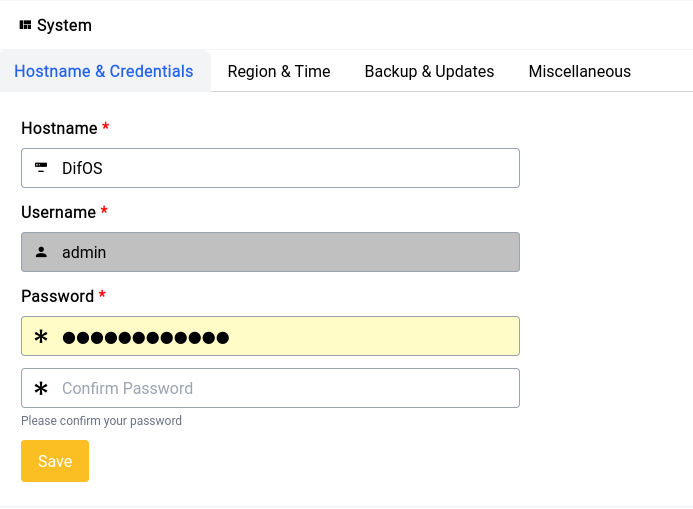
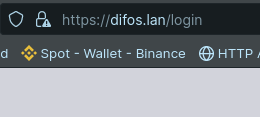
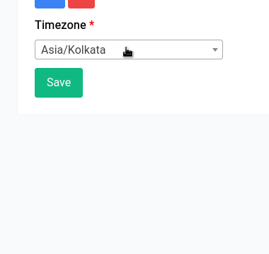
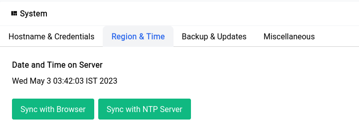
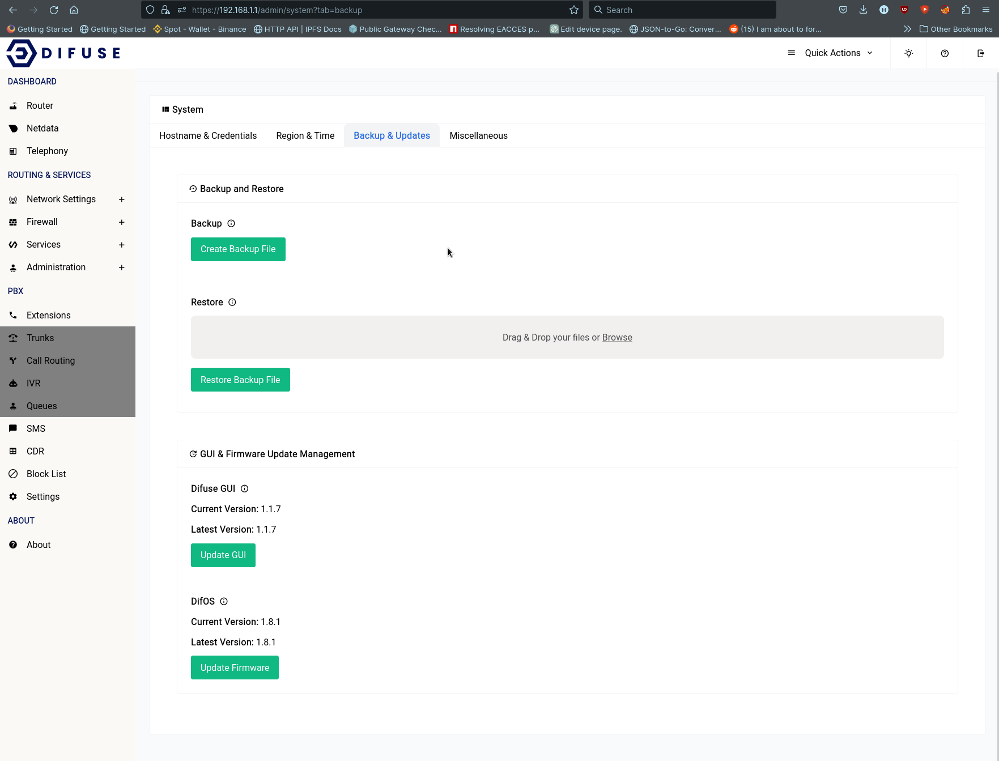
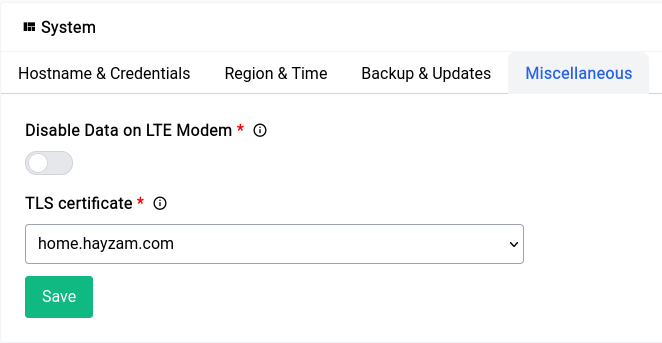

# Administration - System

System Administration is the place to go for all the system related settings and utilities. This section is divided into multiple sub-sections: 

- **Hostname & Credentials** - Set the hostname and change the credentials for the web interface as well as root user.
- **Region & Time** - Set the region and timezone for the system.
- **Backup & Updates** - Backup and restore the system, as well as update the system.
- **Miscellaneous** - Miscellaneous system settings.

## Hostname & Credentials

<a data-fancybox data-src="./img/2.png" data-caption="System - Hostname & Credentials - Overall">
  
</a>

You can give something short and sweet for the hostname and access your device from the LAN using <hostname>.lan in our case that’s difos.lan

<center>
    <a data-fancybox data-src="./img/3.png" data-caption="System - Hostname & Credentials - Browser">
        
    </a>
</center>

```admonish warning
Changing the GUI password will also change the root password of the device
```

You can also setup a strong password here. It’s very important that you change your password the moment you boot up the device for the first time to ensure that you’re safe and secure.

## Region & Time

The date and time are crucial for proper functioning of many services within the device so it’s imperative that you set them up properly.

<center>
    <a data-fancybox data-src="./img/4.gif" data-caption="System - Region & Time">
        
    </a>
</center>

If for some reason it doesn't show the right time like this:

<center>
    <a data-fancybox data-src="./img/5.png" data-caption="System - Region & Time - Refresh">
        
    </a>
</center>

You can always click on the **Sync with NTP Server** button to sync the time with the NTP server.

## Backup & Updates

```admonish warning
**Never** restart or turn off your device while it’s updating as this could lead to corruption of the filesystem which can be a hassle to fix.
```

We’ve fine tuned the backup and updates process with a lot of care and it’s as simple as clicking 3 buttons to get your device up and running with the latest updates.

To take a backup of your currently running system you can just click on the green **Create Backup File** button and it should automatically start downloading a gunzipped tar ball that can be used for restoration later using the form right below it. It might take a few seconds for the entire system to be backed up and the file size all things considered should be around 20MB, the file is somewhat large because it also backs up all the asterisk sounds by default.

Once the restore is done the GUI should restart automatically within a few seconds and restore all the configurations found in the backup file.

<a data-fancybox data-src="./img/6.gif" data-caption="System - Backup & Updates">
  
</a>

The **Difuse GUI** and **DifOS Firmware** update also can be done in the very same way, by just clicking on the update button and then letting the device do it’s thing.

## Miscellaneous

<center>
    <a data-fancybox data-src="./img/7.png" data-caption="System - Miscellaneous">
        
    </a>
</center>

### Disabling Data on LTE module

If you have LTE module installed on your device and you use it for calls and-or SMS, it’s important to disable the data on that device as when there’s a call in progress some telecom operators don’t support the version of LTE that lets call and data pass at the same time and this will lead to calls being dropped as a result.

The main reason this happens is because the device aggressively tries to maintain an active internet connection (every 30 or so minutes the ISP forces a drop in most cases) so it will restart the module to re-initiate a connection, this happens only when the LTE module is not in use so when this restart occurs the calls are dropped.

### TLS Certificate

This section let’s you use a TLS certificate that you generated with [ACME](/services/acme-certificates.html), it’s particularly useful if you’re going to me administering/monitoring the device on the go, this will take care of all TLS warnings in browsers.