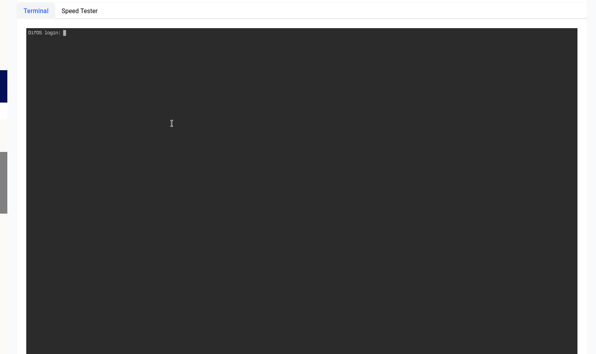

# Administration - Utilities

Utilities come with 2 tabs:

- **Terminal** - This tab contains an iframe to a running **ttyd** terminal instance.
- **Speed Tester** - This tab contains a speedtest tool that can be used to test the speed of your internet connection.

## Terminal

```admonish warning
The terminal is a powerful tool, please use it with caution. If you make an **irrepairable** change to the system, your warranty will be voided.
```

The terminal is a web-based terminal emulator that allows you to run commands on the system. It's powered by [ttyd](https://github.com/tsl0922/ttyd).

<a data-fancybox data-src="./img/1.gif" data-caption="Utilities - Terminal">
  
</a>

This can be very useful in cases of troubleshooting, the underlying operating system has very little userland packages installed, this is done to keep the operating system itself very small. 

The password for the user root is the same as your admin password for the GUI. It’s highly recommended to change that using the GUI itself (the admin password and root password will change at the same time).

Again it’s imperative to note that if you **do not** fully understand what you’re doing it’s best not to use the terminal.

## Speed Tester

The Speed Tester leverages Cloudflare’s speed.cloudflare.com to provide accurate network tests, it might take upto a minute to run each test and you need to obviously have a WAN configuration.

If you had ran a speed test while configuring the SQM functionality, that old speed test will show up here.