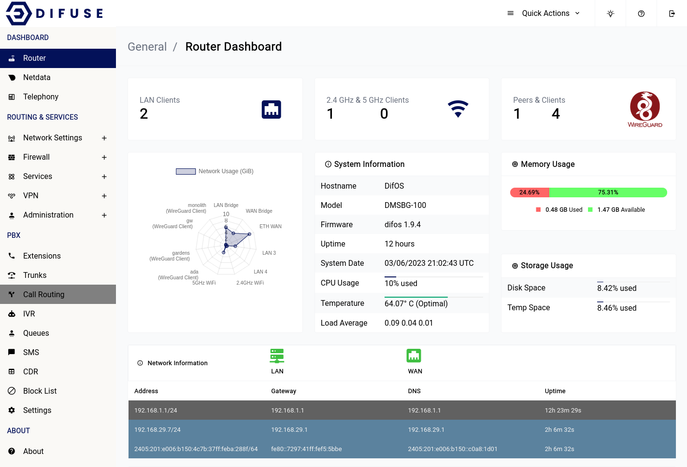
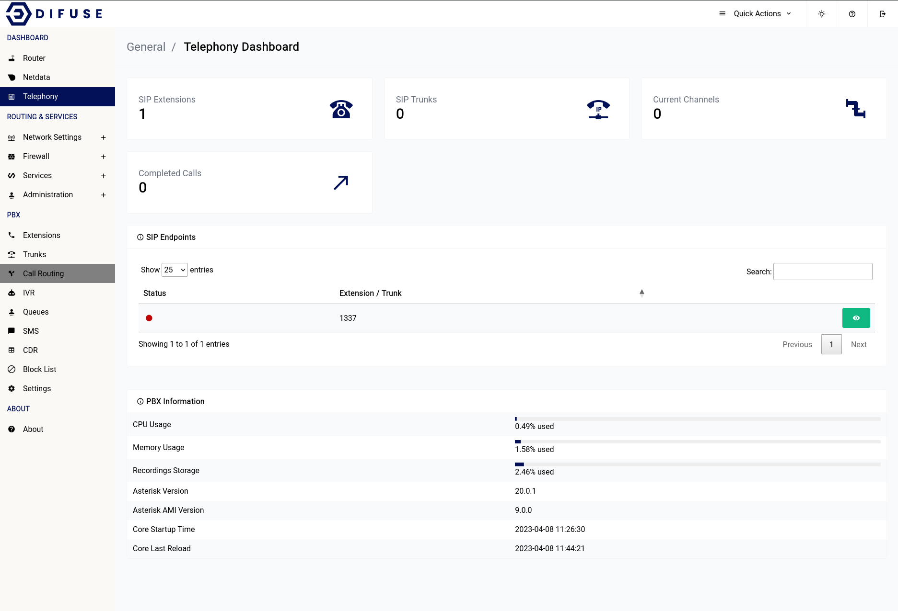

# Dashboards

Dashboards are a powerful tool for visualizing and monitoring the performance of your network and communication systems. With dashboards, you can easily track key metrics, detect issues and troubleshoot problems before they become critical.

At Difuse, we understand the importance of having real-time visibility into the performance of your network and communication systems. That's why we have developed three distinct dashboards - one for the router, one for telephony, and one for netdata - each tailored to provide you with unique insights into different aspects of your system.