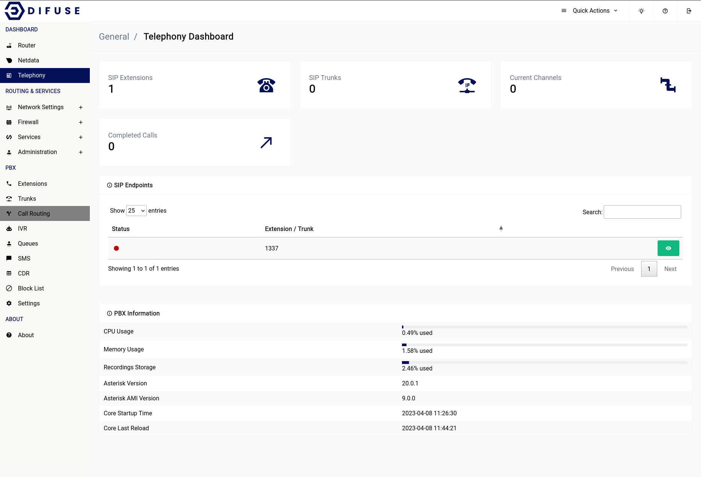

# Dsahboard - Telephony

Telephony menu gives out all relevant infomation about the telephony service in the system.

All the PJSIP endpoints that are available on the system will be available in the SIP endpoints section.

If you have a VoIP provider that needs to know what version of asterisk you’re running to setup on their end you can copy the version from the PBX Information table below as shown.

