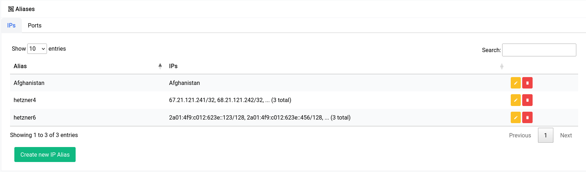

# Firewall - Aliases

Aliases are a way to define a group of network objects, such as IP addresses (in CIDR notation) and ports, and give them a name that can be used in firewall rules.

## IP Aliases

Let’s explore aliases through 2 examples, one where we define a manual alias and another where we take a look at automated aliases.

* <b>Manual Aliases</b>: This type of alias is where you specify the IP Address in CIDR notation (or ports in the case of a ports alias) yourself.
* <b>Automated Aliases</b>: This type of alias is where you specify a network interface and the alias will automatically populate with the IP Addresses of the devices connected to that interface.

### Manual Aliases

Okay now let’s explore manual aliases through an example. Imagine we have 3 VPS’s that are hosted outside the confines of our internal network. And they have the following IPv4 and IPv6 addresses respectively:

```
67.21.121.241/32
68.21.121.242/32
69.21.121.243/32
```

```
2a01:4f9:c012:623e::123/128
2a01:4f9:c012:623e::456/128
2a01:4f9:c012:623e::789/128
```

Now obviously you can create 6 different firewall rules for all 6 of these addresses or you could group these addresses into just 2 aliases and use them within 2 different rules.

```admonish warning
You cannot have a mix of <b>IPv4</b> and <b>IPv6</b> addresses in an alias, they <b>have</b> to be separate and they <b>must</b> be written in CIDR notation.
```

Now first we go about creating our alias for the IPv4 addresses and then for the IPv6 ones. 

<a data-fancybox data-src="./img/1.png" data-caption="Firewall - Aliases - Add IPv4">
  
</a>

<a data-fancybox data-src="./img/2.png" data-caption="Firewall - Aliases - Add IPv6">
  
</a>

After you’ve created them they should show up in the table like this:

<a data-fancybox data-src="./img/3.png" data-caption="Firewall - Aliases - Table">
  
</a>

Now if you try to add or edit a rule in Traffic Rules, you should see the aliases show up in the source and destination address sections.

<a data-fancybox data-src="./img/4.png" data-caption="Firewall - Traffic Rules - Add Rule">
  
</a>

### Automated Aliases

```admonish error
When you’ve never had an internet connection on your device, the lists may show up as empty.
```

Now for automated aliases, underneath it works pretty much the same way manual aliases do. But instead of the user painstakingly adding each IP for a region for instance they could use a list that is pre-made that are updated in a timely manner by Difuse itself without any need for intervention.

Now if we want to make a list that includes all the IPs that are associated with the country **Afghanistan** for instance, we could just select the type of alias as **Automatic** and select the list **Afghanistan**. You can select multiple countries as well.

<a data-fancybox data-src="./img/5.png" data-caption="Firewall - Aliases - Add Automatic">
  
</a>

Multiple country list selection would look something like this:

<a data-fancybox data-src="./img/6.png" data-caption="Firewall - Aliases - Add Automatic">
  
</a>

You can click on the **Update Lists** button if you want to manually run an update on the lists that exists on the system.

```admonish note
Running an update will update all the lists not just the ones selected.
```

Now once an alias has been created with one of the automated lists, it should look like this in the table:

<a data-fancybox data-src="./img/7.png" data-caption="Firewall - Aliases - Table">
  
</a>

They can also be used in the firewall in the same way as shown for manual aliases.

```admonish note
It should be clear in the particular traffic rule whether it is of the family IPv4 or the family IPv6 if you’re using an automated list. Meaning you should set the destination or source address of the IPv4 or IPv6 family. It could even be **0.0.0.0/0** or **::0/0** for IPv4 and IPv6 respectively. This is to let the underlying engine know which version of the list to use for that particular rule.
```

## Ports Aliases

Ports Aliases also works in a similar way to that of IP Aliases. The key difference being that there isn’t a way to select an automated list.

Now for instance if you have a bunch of HTTP services that you run within your office and home you might want to enable the ports 80, 443 and maybe even 8080 for each of those IPs. You could just create an alias as shown below.

<a data-fancybox data-src="./img/8.png" data-caption="Firewall - Aliases - Add Ports">
  
</a>

Once you create the alias it should show up in the table like this:

<a data-fancybox data-src="./img/9.png" data-caption="Firewall - Aliases - Table">
  
</a>

It’s imperative to note that you should **NOT** use **aliases** or **traffic rules** to block specific websites on the LAN, instead the **Content Filtering & Adblock** service should be used. Due to advent of services like cloudflare (which incidentally a lot of websites use) multiple hundreds or even thousand websites may share the same IP address, which makes it very hard to just block one or two websites with traffic rules.