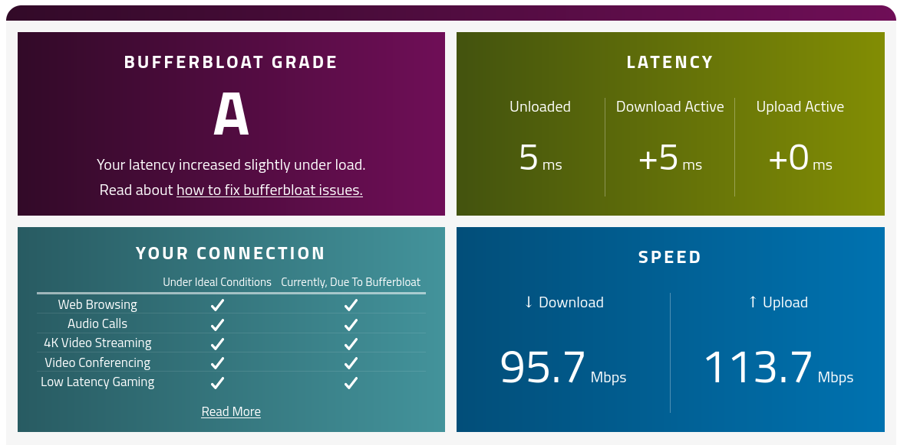

# Firewall - Bandwidth Control

Bandwidth control encompasses both Quality of Service (QoS) and Smart Queue Management (SQM):

1. **Quality of Service (QoS)**: Also commonly known as Rate Limiting is used to limit the upload and download speed of a particular client on the network.
2. **Smart Queue Management (SQM)**: This feature allows the router to prioritize certain kinds of traffic and help reduces delays when the it becomes overloaded.

## Quality of Service (QoS)

Rate limiting allows the device to limit the traffic that egresses through a port to a value less than the available link bandwidth. So if there’s a network peer consuming too much bandwidth you can limit their egress and ingress flow rate and effectively reduce network congestion experienced by other peers.

In the **General Settings** page the default upload and download rates are rates which are applied for entries in the Limit by IP and Limit By Mac sections when they’re added without specifying a limit.

The whitelist are for devices that should not have any effect on their bandwidth no matter what happens.

<a data-fancybox data-src="./img/25.png" data-caption="Firewall - Bandwidth Control - General Settings">
  
</a>

```admonish note
All speeds are both stored and entered in **Megabits/second (Mbps)**
```

### Limiting by IP Address

```admonish warn
When the IP Address for the client changes, these rules obviously lose their efficacy.
```

<center>
<a data-fancybox data-src="./img/26.png" data-caption="Firewall - Bandwidth Control - Limit by IP">
  
</a>
</center>

An example entry for limiting by **IP address**. 

### Limiting by MAC Address

Limiting by MAC address is highly preferable to IP Address as it’s much harder for a user to change a device’s mac address than it is to change the IP.

Here’s a simple limit added to a client on the network:

<center>
<a data-fancybox data-src="./img/27.png" data-caption="Firewall - Bandwidth Control - Limit by MAC">
  
</a>
</center>

If you’re thinking of an easy way to get the MAC addresses of the client, all you need to do is go into the **Static Leases** section of the **DNS & DHCP** Configuration and copy from there.

<a data-fancybox data-src="./img/28.png" data-caption="DNS & DHCP - Static Leases">
  
</a>

## Smart Queue Management (SQM)

QoS does rate limiting the old way as it doesn’t really care about what the packets look like, it just will cut off the user at a certain point, but SQM works in a very clever way to prioritize packets based on what they actually are.

Setting up SQM is **very** straight-forward. You just need to type in the ISPs advertised download and upload speeds or just click on the **“Auto Fill Speeds”** button which will do it for you.

```admonish warn
It’s **highly** recommended to fill in 90-95% of the advertised speeds to get the most out of SQM, otherwise the intended functionality won’t really take into effect.
```

<center>
<a data-fancybox data-src="./img/29.png" data-caption="Firewall - Bandwidth Control - SQM">
  
</a>
</center>

When you fill in the speeds using the auto fill button, it will calculate the exact amount you need by subtracting the necessary values instead of you having to do it yourself. If you think it’s way off (it should be within ~90 - 95% of the advertised speeds) by +5% or -5% feel free to make the changes yourself and save the settings.

It’s a good idea to check your routers bufferbloat results using [this](https://www.waveform.com/tools/bufferbloat) really great tool. We did a couple of tests with and without enabling SQM and below are the results.

```admonish quote
Bufferbloat is a software issue with networking equipment that causes spikes in your Internet connection’s latency when a device on the network uploads or downloads files.
```

### Bufferbloat - Without SQM

<a data-fancybox data-src="./img/30.png" data-caption="Bufferbloat - Without SQM">
  
</a>

### Bufferbloat - With SQM

<a data-fancybox data-src="./img/31.png" data-caption="Bufferbloat - With SQM">
  
</a>