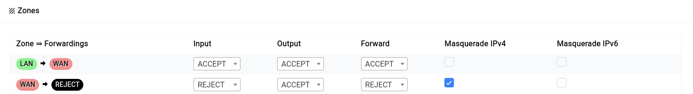

# Firewall

Difuse uses NFTables to manage the firewall. NFTables is a Linux kernel subsystem that provides packet filtering, network address translation (NAT) and other packet mangling. NFTables is the successor to iptables.

By default the device is configured to allow all traffic from the LAN network to the WAN network and block all traffic from the WAN network to the LAN network. This is the most secure configuration for an office or home network. If you need to allow traffic from the WAN network to the LAN network, you can create a custom rule to allow the traffic.