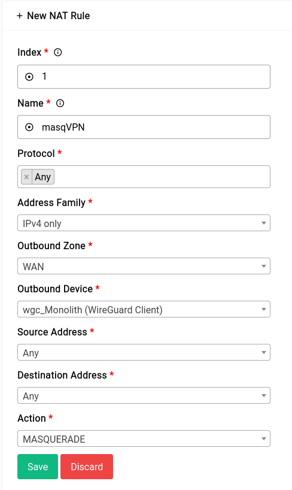
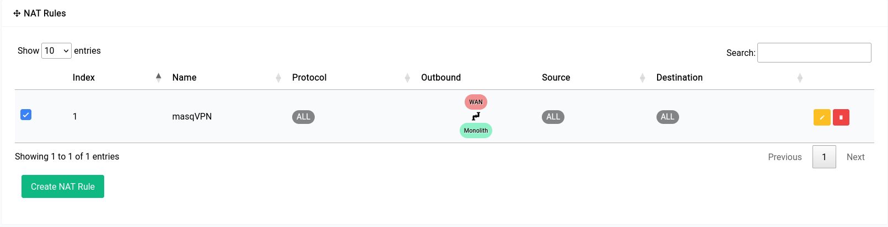

# Firewall - NAT Rules

Network Address Translation (NAT) allows you to translate IP addresses and ports for traffic flowing between networks.

It translates private IP addresses into public IP addresses, allowing private IP networks to connect to the internet and hiding the internal network behind the public IP address. You can create source NAT (SNAT) and Masquerade rules to enable traffic flow between private and public networks by translating non-routable, private IP addresses to routable, public IP addresses. You can create NAT rules for IPv4 and IPv6 networks.

Here's an example of a NAT (Masquerade) rule:

Once the rule is created it would look something like this in the table:

