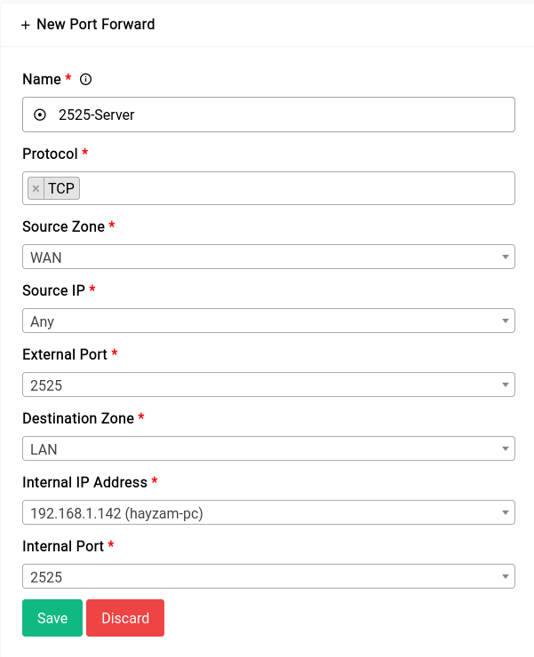

# Firewall - Port Forwarding

Port forwarding is a networking technique that allows incoming traffic to reach a specific computer or device on a private network, by forwarding traffic from a specific port on the public-facing router or gateway to a corresponding port on the private network.

In other words, port forwarding allows a device on a private network, such as a home network, to receive incoming traffic from the internet. It is often used to allow remote access to services running on a computer or device behind a router or firewall, such as web servers, FTP servers, or gaming servers.

```admonish note
Only the **source** field can have an alias for portfowards, unlike traffic rules which can have both **source** and **destination** aliases.
```


Now for purposes of demonstration we have an HTTP server listening on port 2525 on the IP 192.168.1.143. We need all hits to WAN IP and port 2525 to forward to that IP and port on the internal network

The new rule would look something like this:

<a data-fancybox data-src="./img/10.png" data-caption="Firewall - Port Forwarding - Add">
  
</a>

Once the rule is created it would look something like this in the table:

<a data-fancybox data-src="./img/11.png" data-caption="Firewall - Port Forwarding - Table">
  
</a>