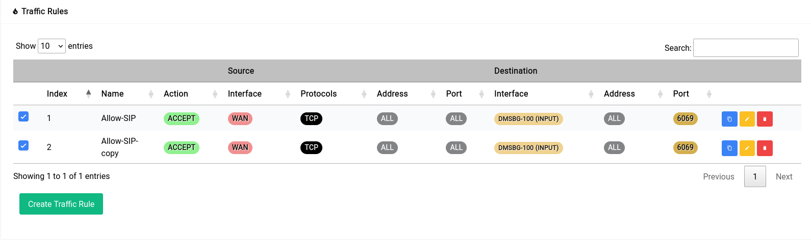
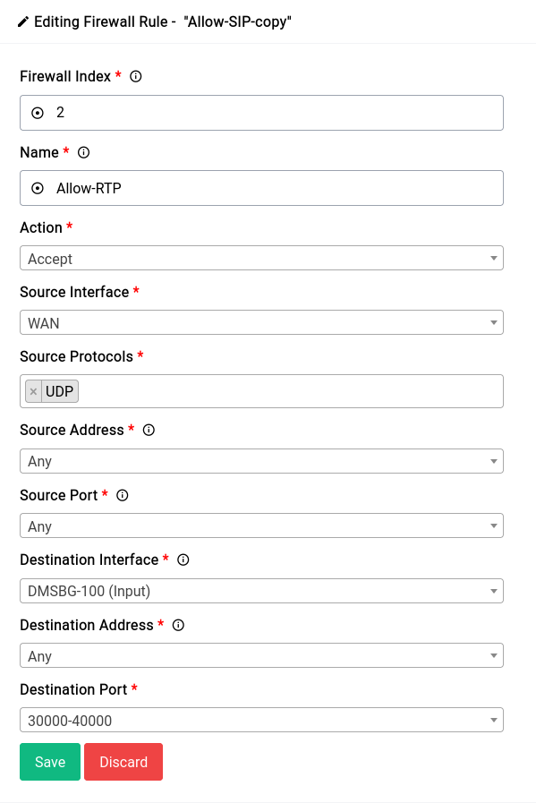
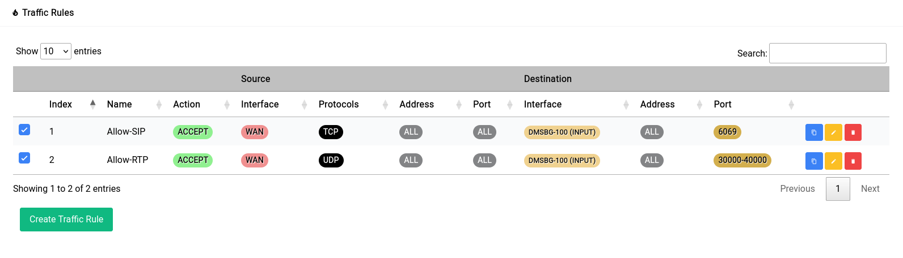

# Firewall - Traffic Rules

Traffic rules are used to control the flow of incoming and outgoing traffic on a network. These rules specify the conditions under which traffic is allowed or denied, as well as the actions that should be taken when these conditions are met.

For purposes of demonstration we are going to create 4 firewall rules:

1. A rule that allows connections to the TLS SIP Port (**6069**) that the underlying asterisk instance uses.
2. A rule allows RTP connections in the default port range (**20000-30000**) that the underlying asterisk instance uses.
3. A rule that allows for remote administration of Difuse (port **443** and **80**).
4. A rule that let’s all traffic through to a specific globally routable **IPv6** address.

```admonish info
Index’s are assigned automatically at the creation of a new rule. You can edit them later to placed before or after a particular rule if need be using the same index field.
```

## Allowing TLS SIP Connections

This is what adding the rule should look like:

<a data-fancybox data-src="./img/12.png" data-caption="Firewall - Traffic Rules - Add Rule - 1">
  
</a>

Now once you add a rule, it doesn’t get applied right away. You can see that there’s a red pill that pops up near the title

<a data-fancybox data-src="./img/13.png" data-caption="Firewall - Traffic Rules - Unconfirmed Pill">
  
</a>

When you click on it, it shows you a gist of the things that have been changed:

<a data-fancybox data-src="./img/14.png" data-caption="Firewall - Traffic Rules - Unconfirmed - Gist">
  
</a>

It’s really not a good idea to keep these unsaved changes for a long time as they’re **ephemeral** and have to be committed to disk or discarded at some point in time.

Once you click apply you will see it go away and the rule you added will show up in the table as such:

<a data-fancybox data-src="./img/15.png" data-caption="Firewall - Traffic Rules - Added Rule">
  
</a>

## Allowing UDP Port Range

Now if you think about it, the next rule we’re going to make is pretty similar to that of the first one with few key changes namely:

* The protocol is **UDP** instead of **TCP**
* The port is a range of **30000-40000** instead of being just **6069**

But all the other options are identical, in this case we can make use of the copy function that is present in the last column of the table denoted by the blue button.

```admonish warn
When you make a copy of a rule all unsaved changes are automatically written to disk.
```

The copy of the rule you made should show up in the list like this:

<a data-fancybox data-src="./img/16.png" data-caption="Firewall - Traffic Rules - Added Rule - 2">
  
</a>

Now we can edit the second rule by clicking on the yellow edit button, the edited rule would look something like this:

<a data-fancybox data-src="./img/17.png" data-caption="Firewall - Traffic Rules - Edit Rule - 2">
  
</a>

Again just like the first rule, it’ll go into the unsaved changes pill and once you apply the changes it should look something like this in the table:

<a data-fancybox data-src="./img/18.png" data-caption="Firewall - Traffic Rules - Added Rule - 2">
  
</a>

Now there’s a reason why these rules are not turned on by default, the reason being that it’s **incredibly** insecure to have an open SIP port. You should make **sure** that all the extensions in your system are using really strong passwords among other things before you make such a rule.

## Allowing Remote Administration

For this rule we’re gonna make use of a Ports Alias. Namely “HTTP ports” alias that has the ports 80 and 443 defined. These are the ports that Difuse uses for remote management. This would save us from having to create 2 separate rules.

<a data-fancybox data-src="./img/19.png" data-caption="Firewall - Traffic Rules - Add Rule - 3">
  
</a>

If you remember in our **Aliases** setup we mentioned that the firewall rule must make it abundantly which family of IP Addresses (IPv4 or IPv6) the rule should be applied for.

Since we didn’t specify any source or destination addresses and there’s an alias involved, this rule will automatically **only** be applied for **IPv4** addresses.

<a data-fancybox data-src="./img/20.png" data-caption="Firewall - Traffic Rules - Gist - 3">
  
</a>

As you can see from the unsaved pages dialogue. If you’re not using IPv6 it’s fine but if you are and want IPv6 hosts to be able to access something as well it’s a good idea to make a second rule by copying the first rule and specifying the source or destination address as `::0/0`. This would **coerce** the underlying system to use IPv6 as the port alias type.

After the rule has been made the table should look something like this:

<a data-fancybox data-src="./img/21.png" data-caption="Firewall - Traffic Rules - Added Rule - 3 - Table">
  
</a>

## Allowing All Traffic to a Specific IPv6 Address

If your ISP hands out a sufficiently large prefix (/64 or below) all devices on the host network should already have a globally routable IPv6 address. Now in this case we want the firewall to let all traffic flow to and from a specific IPv6 address without any blocks whatsoever.

First you need to find the IPv6 address of the host and then create a new rule. The new rule would look something like this:

<a data-fancybox data-src="./img/22.png" data-caption="Firewall - Traffic Rules - Add Rule - 4">
  
</a>

```admonish note
It's a bad idea to allow all traffic to a specific IPv6 address. You should only do this if you know what you're doing, we're just using this as an example.
```