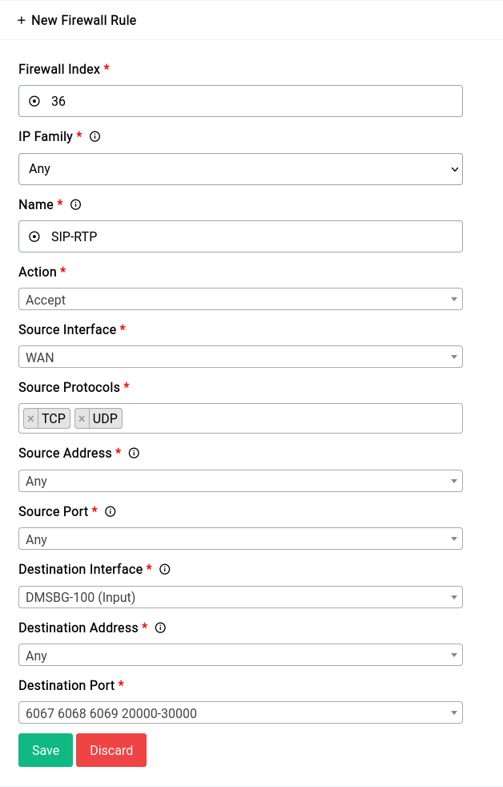
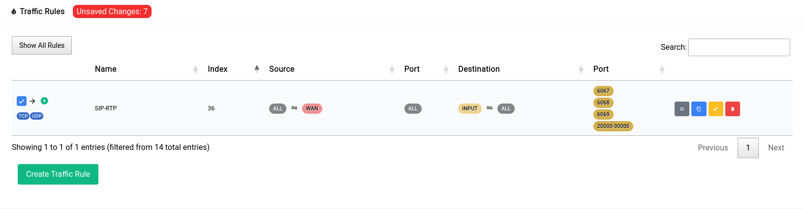
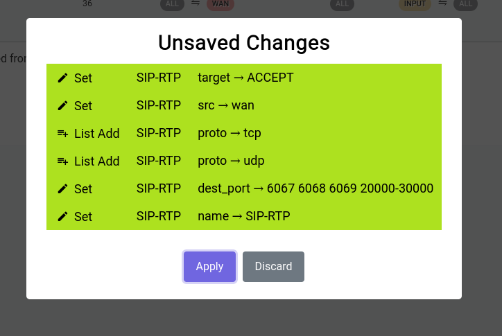
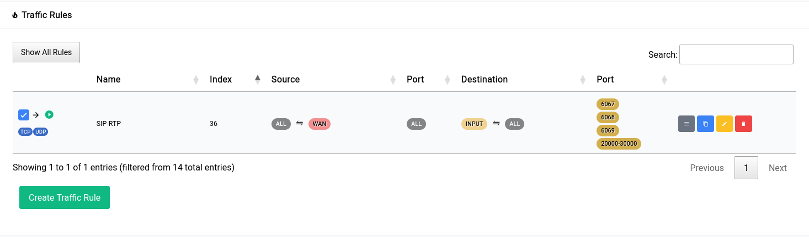
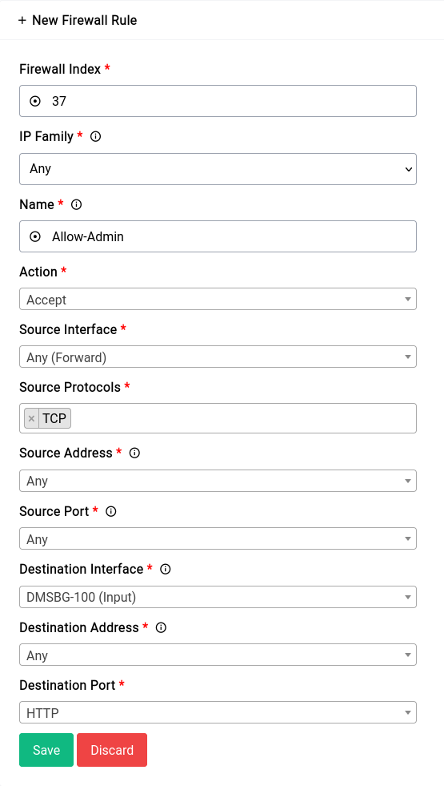
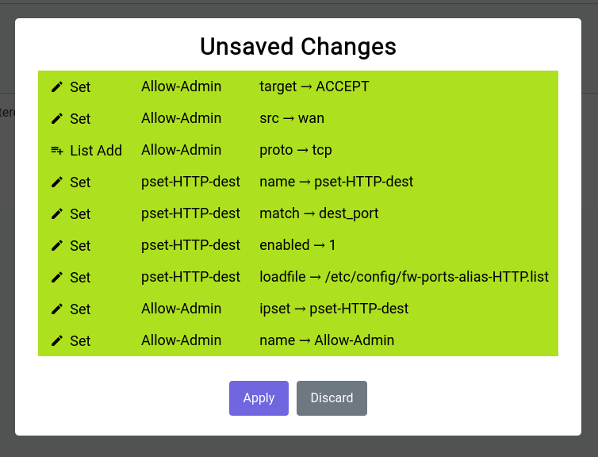
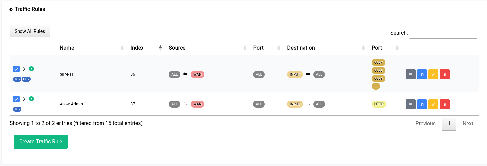
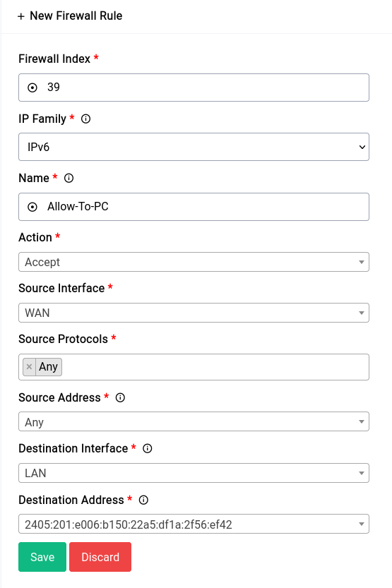

# Firewall - Traffic Rules

Traffic rules are used to control the flow of incoming and outgoing traffic on a network. These rules specify the conditions under which traffic is allowed or denied, as well as the actions that should be taken when these conditions are met.

For purposes of demonstration we are going to create 4 firewall rules:

1. A rule that allows connections to all the SIP and RTP ports which are:
   * SIP: 6067 (**UDP**)
   * SIP: 6068 (**TCP**)
   * SIP TLS: 6069 (**TCP**)
   * RTP: 20000-30000 (**UDP**)


2. A rule that allows for remote administration of Difuse using the TCP ports 80 and 443.
3. A rule that let’s all traffic through to a specific globally routable **IPv6** address.

```admonish info
Index’s are assigned automatically at the creation of a new rule. You can edit them later to placed before or after a particular rule if need be using the same index field or you can use the grey button in the table to drag and drop the rules in the order you want.
```

## Allowing SIP and RTP connections

This is what adding the rule should look like:

<a data-fancybox data-src="./img/12.png" data-caption="Firewall - Traffic Rules - Add Rule - 1">
  
</a>

Now once you add a rule, it doesn’t get applied right away. You can see that there’s a red pill that pops up near the title

<a data-fancybox data-src="./img/13.png" data-caption="Firewall - Traffic Rules - Unconfirmed Pill">
  
</a>

When you click on it, it shows you a gist of the things that have been changed:

<a data-fancybox data-src="./img/14.png" data-caption="Firewall - Traffic Rules - Unconfirmed - Gist">
  
</a>

It’s really not a good idea to keep these unsaved changes for a long time as they’re **ephemeral** and have to be committed to disk or discarded at some point in time.

Once you click apply you will see it go away and the rule you added will show up in the table as such:

<a data-fancybox data-src="./img/15.png" data-caption="Firewall - Traffic Rules - Added Rule">
  
</a>

## Allowing Remote Administration

For this rule we’re gonna make use of a Ports Alias. Namely the “HTTP” alias that has the ports 80 and 443 defined. This is just for demonstration you could also just specify the ports directly with a space in between them.

```admonish warning
This is an exceedingly **bad** idea. You should never allow remote administration of your router with source set to ANY ip unless you know what you're doing. We're just using this as an example.
```

<a data-fancybox data-src="./img/19.png" data-caption="Firewall - Traffic Rules - Add Rule - 3">
  
</a>

The unsaved changes modal should look something like this:

<a data-fancybox data-src="./img/20.png" data-caption="Firewall - Traffic Rules - Gist - 3">
  
</a>

After the rule has been made the table should look something like this:

<a data-fancybox data-src="./img/21.png" data-caption="Firewall - Traffic Rules - Added Rule - 3 - Table">
  
</a>

## Allowing All Traffic to a Specific IPv6 Address

```admonish warning
It's a **bad** idea to allow all traffic to a specific IPv6 address. You should only do this if you know what you're doing, we're just using this as an example.
```

If your ISP hands out a sufficiently large prefix (/64 or below) all devices on the host network should already have a globally routable IPv6 address. Now in this case we want the firewall to let all traffic flow to and from a specific IPv6 address without any blocks whatsoever.

First you need to find the IPv6 address of the host and then create a new rule. The new rule would look something like this:

<a data-fancybox data-src="./img/22.png" data-caption="Firewall - Traffic Rules - Add Rule - 4">
  
</a>