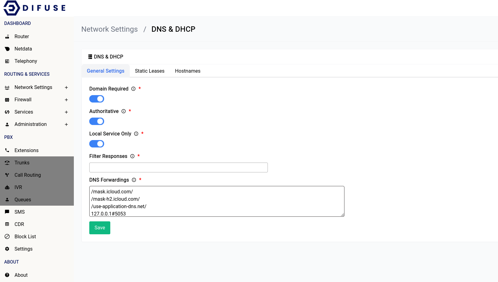

# Network Settings - DNS & DHCP - General

The general page offers a few options to configure the DNS & DHCP settings, let's go over all of them:

## DHCP Authority

This option will set the DHCP server running inside your device as the only one in the network, if you have another DHCP server that is running in authoritative mode you can turn this off here.

## Hijack DNS

This option will hijack all DNS requests and redirect them to the device itself, this is useful if you want to force all clients on your network to use the DNS server running on difuse.
