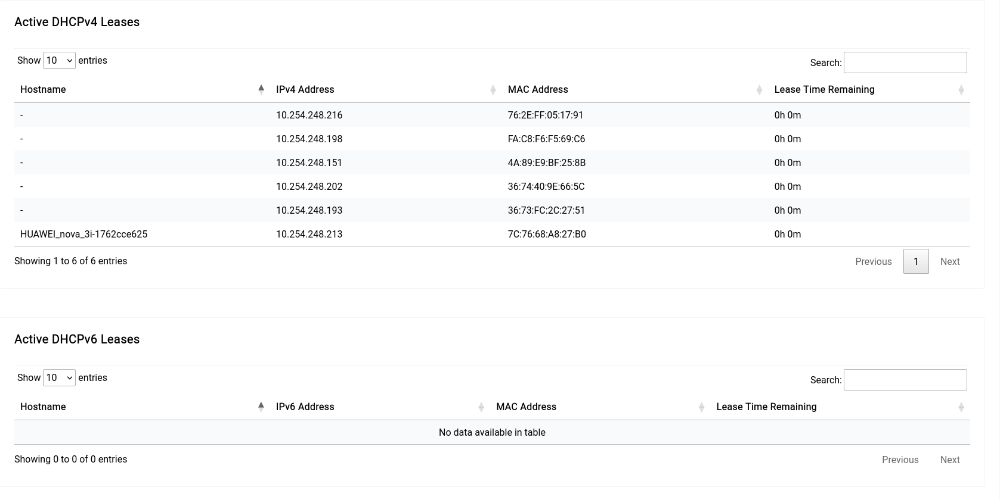
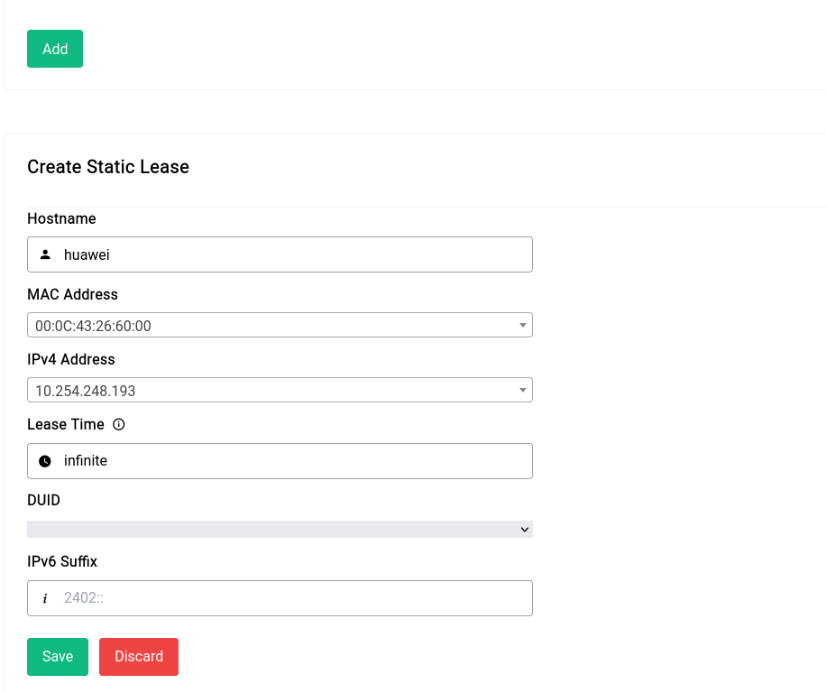
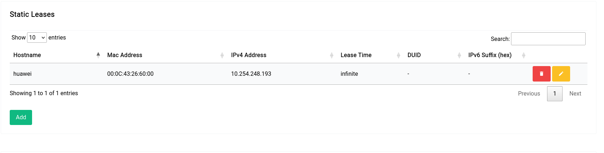

# Network Settings -  DNS & DHCP - Active & Static Leases

This section is where you can view all the active and static leases on your network. You can see all the active leases on the device by scrolling down to the bottom of the tab <b>Static Leases</b>

<a data-fancybox data-src="./img/2.png" data-caption="Network Settings - DNS & DHCP - Active & Static Leases">
  
</a>

## Static Leases

Creating a static lease is trivial all you need to do is click on the “Add” button and fill out the form:

<a data-fancybox data-src="./img/3.png" data-caption="Network Settings - DNS & DHCP - Static Leases">
  
</a>


```admonish info
If there are no IPv6 leases that the DHCP server gives out, the DUID input will be greyed out and you don’t have to specify anything in the IPv6 suffix section.
```

Once you add the static lease, it’ll look like this in the table:

<a data-fancybox data-src="./img/4.png" data-caption="Network Settings - DNS & DHCP - Static Leases">
  
</a>