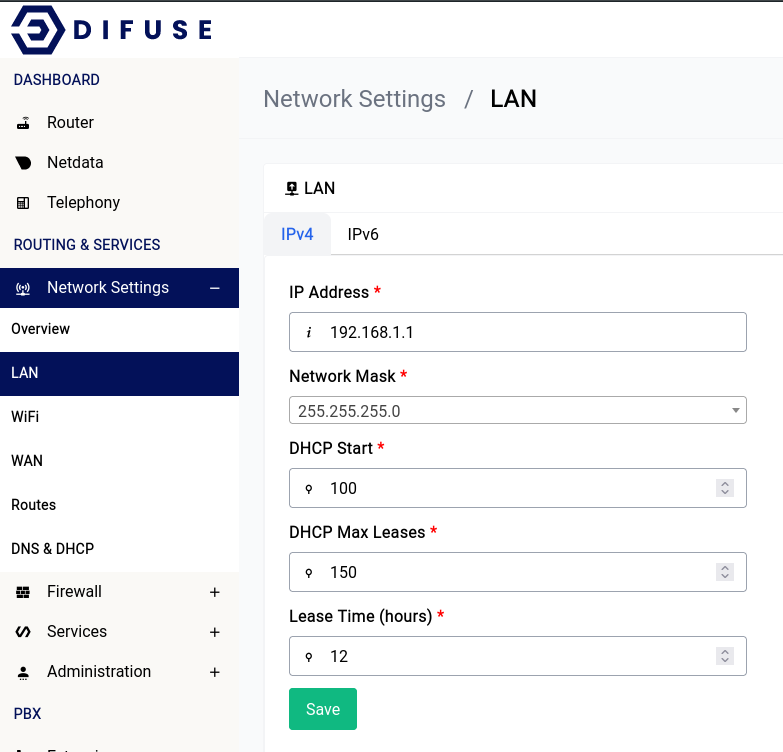

# Network Settings - LAN

LAN stands for Local Area Network. This is the network that your router is connected to. This is the network that your devices will connect to and be assigned an IP address from.

LAN configuration can be found in the Network Settings tab under the LAN section.

