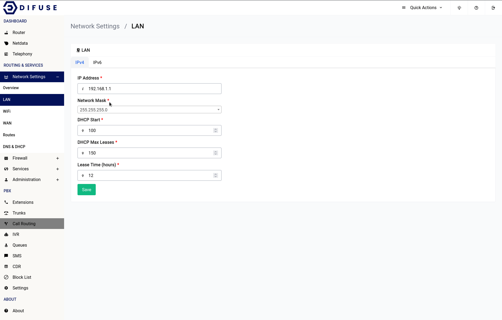

# Network Settings - LAN - IPv4 Configuration

Setting up a local network requires careful consideration of the IP addresses to be used. Using private IP addresses from the reserved address space, such as 10.0.0.0/8, 172.16.0.0/12, and 192.168.0.0/16, is recommended to avoid issues with overlapping addresses on the internet.

To further optimize your network, it is recommended to use smaller broadcast domains. This means breaking down the network into smaller groups of IP addresses, rather than using a larger network with millions of addresses. For example, using a network with 254 IP addresses like 10.10.10.0/24 is better than using a network with over 16 million addresses like 10.0.0.0/8. This can help to prevent future conflicts with other remote networks in case you need to link them with a VPN.

```admonish info
The factory set default IP is 192.168.1.1/24
```

To explore the network interface configuration options, head to the Network Settings - LAN under the Routing & Services section.

<a data-fancybox data-src="./img/1.gif" data-caption="Network Settings - LAN">
  
</a>

```admonish warning
LAN IP Address change requires a restart
```

There are other options such as the ones for the DHCP server that runs underneath which can also be specified in the same form.