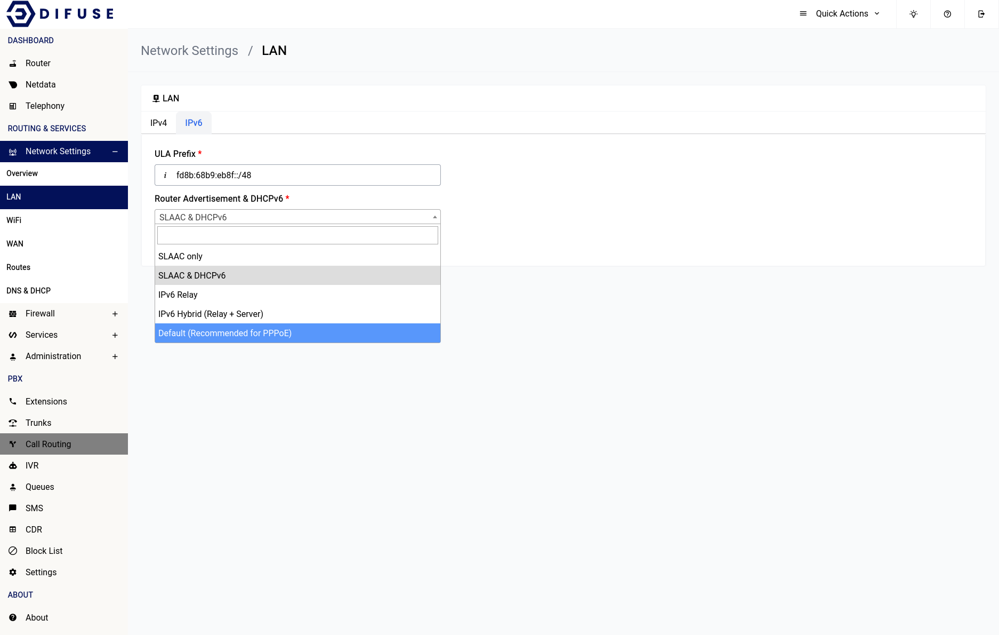

# Network Settings - LAN - IPv6 Configuration

If you navigate to the IPv6 tab you can see there are only 2 options one is the ULA Prefix and the other is the Router Advertisement (RA) and DHCPv6 options.

For most setups the ULA prefix can remain unchanged as it’s randomly generated and is assigned with the right prefix length, only change it if you know what you’re doing. ULA addresses are simply addresses that are routable within the scope of private networks, it’s not globally routable.

Coming to the DHCPv6 options it can be crucial to the setup of IPv6 on your device depending upon your setup layout.

<a data-fancybox data-src="./img/2.png" data-caption="Network Settings - LAN">
  
</a>

## SLAAC only

Stateless Address Autoconfiguration (SLAAC) is a method for automatically configuring IPv6 addresses on a network without the need for a DHCPv6 server. In this method, devices generate their own IPv6 addresses based on the network prefix advertised by the router.

## SLAAC & DHCPv6

This method uses both SLAAC and DHCPv6 to assign IPv6 addresses to devices on a network. SLAAC is used to generate the interface identifier portion of the IPv6 address, while DHCPv6 is used to provide additional information such as DNS server addresses and network time settings.

## IPv6 Relay

This method forwards IPv6 packets between different network segments. In this context, an IPv6 relay is used to forward DHCPv6 requests and replies between the requesting device and a DHCPv6 server on another network segment.

## IPv6 Hybrid (Relay + Server)

This method combines the use of SLAAC, DHCPv6, and an IPv6 relay to assign IPv6 addresses to devices on a network. The IPv6 relay is used to forward DHCPv6 requests and replies between the requesting device and a DHCPv6 server on another network segment, while SLAAC is used to generate the interface identifier portion of the IPv6 address.

```admonish note
If the device is connected as a DHCP client to another router you need to select either IPv6 Relay or IPv6 Hybrid for proper functioning of IPv6
```

## Default (Recommended for PPPoE)

```admonish note
You need to select this option if you’re using a PPPoE based connection
```

This option is the recommended method for assigning IPv6 addresses to devices on a network that uses PPPoE to establish a connection to the internet. This method involves using SLAAC to generate an IPv6 address for the device, based on the /64 (other other) prefix assigned to the PPPoE connection by the ISP's network. Additionally, the device obtains additional network configuration information such as DNS server addresses using stateless DHCPv6. This method does not require the use of a DHCPv6 server to provide IPv6 addresses to devices, and is commonly used in PPPoE-based networks.