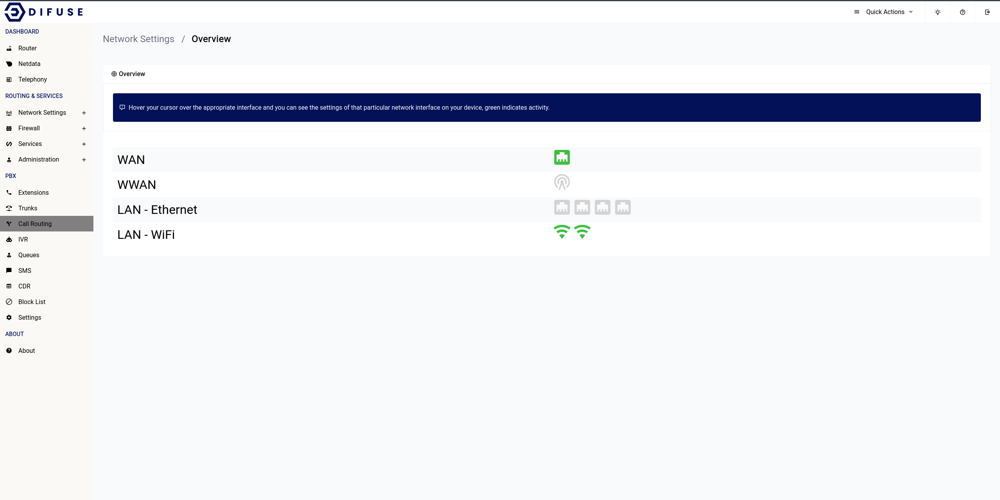

# Network Settings - Overview

The overview page is just to showcase recent activity on each available interface as well as give some critical information like their IP address and MAC address on hover of the interface icon.

