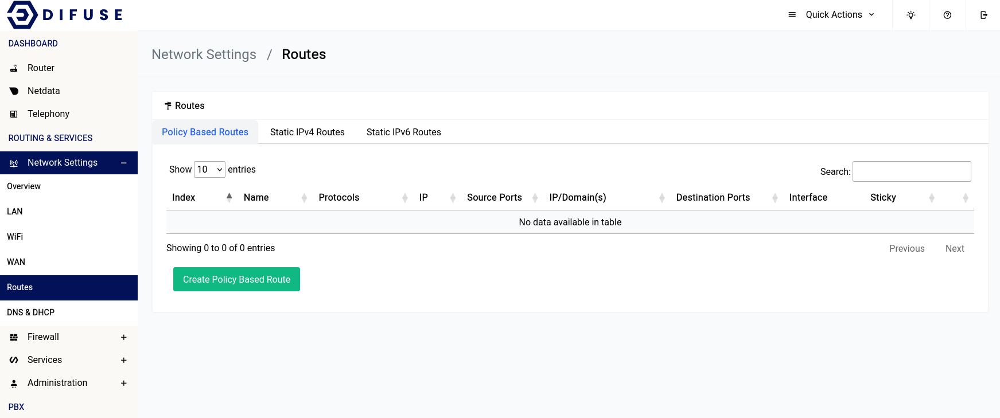

# Network Settings -  Routes

Routes are a set of rules that determine where packets are sent. Routes are used to allow devices to communicate with each other. For example, if you have a device on the LAN network that needs to communicate with a device on the WAN network, you would need to create a route to allow the two devices to communicate. Although that is done automatically by the router, you can create custom routes to allow devices to communicate with each other.