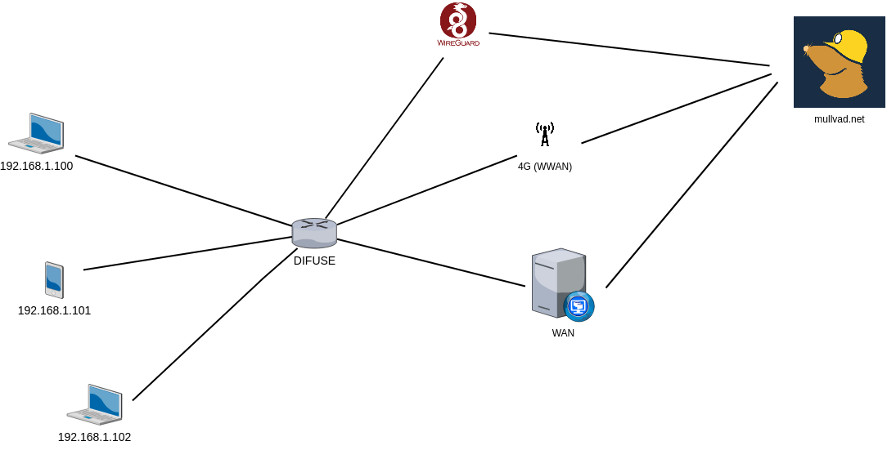
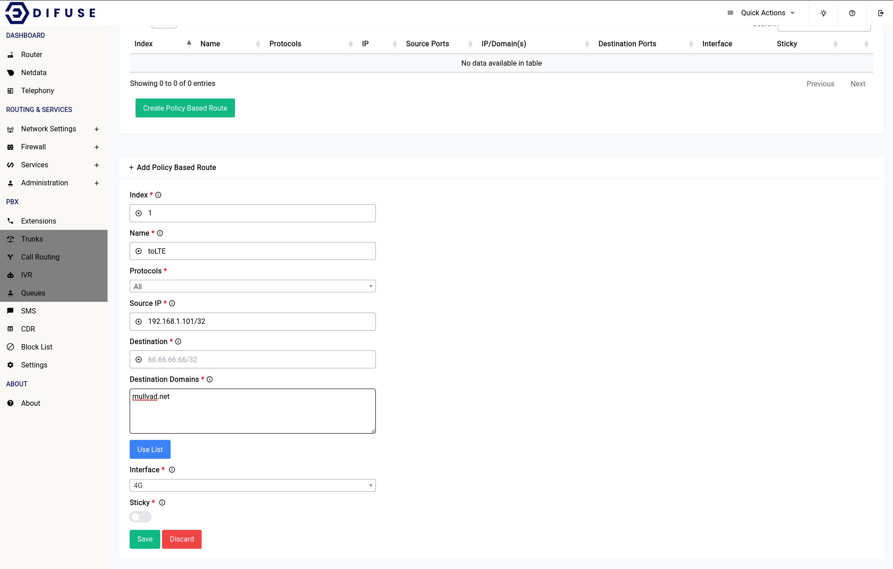
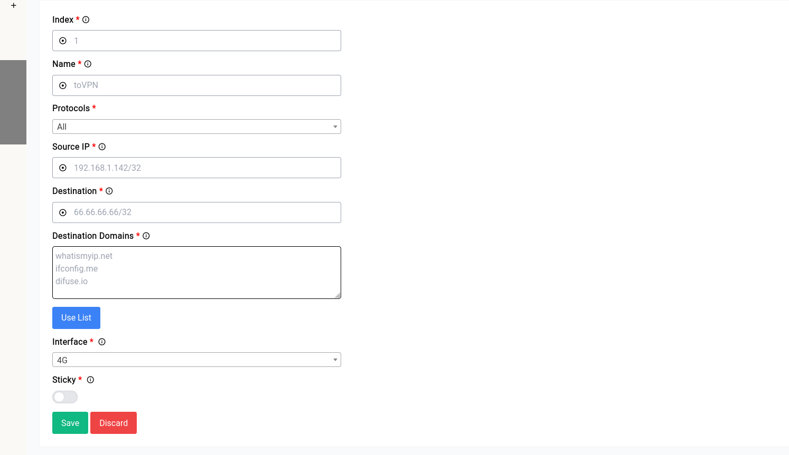

# Network Settings - Routes - Policy Based

```admonish warn
Policy Based Routes will only work with <b>IPv4</b> and not with <b>IPv6</b>
```

Policy-based routing (PBR) is a technique used in computer networking to control how network traffic is routed based on specific policies or criteria.

Traditionally, network traffic is routed based on the destination address in the packet header, using a routing table to determine the appropriate path to take. However, with PBR, the routing decision is based on other factors such as the source address, protocol, port number, destination address etc.

<a data-fancybox data-src="./img/1.png" data-caption="Network Settings - Routes - Policy Based - Demo Topology">
  
</a>

For purposes of demonstration we’re going to create 3 policy routes for 3 different devices on the LAN the above image is what our end goal should look like.

* A PC at 192.168.1.100 when trying to reach <b>mullvad.net</b> should go through regular WAN.
* A Mobile device at 192.168.1.101 when trying to reach <b>mullvad.net</b> should go through WWAN.
* Another PC at 192.168.1.102 when trying to reach <b>mullvad.net</b> should go through a WireGuard endpoint.

If you might’ve noticed the first policy route is not really needed, since any connections to the outside world already goes through the WAN interface.

Now coming to the second policy route, that is something we will have to specifically look out for since WWAN module is always the failover interface, it will never be used as the main gateway.

This is what the rule would look like when you’re trying to add it:

<a data-fancybox data-src="./img/2.png" data-caption="Network Settings - Routes - Policy Based - Add">
  
</a>

As you can see I’ve specified <b>mullvad.net</b> as one of my destination domains and the interface as 4G, you can specify any number of domains as you like, you need not specify each subdomain of a domain just the domain itself. For instance you do not have to give: 

```
1.mullvad.net
2.mullvad.net
```

Instead just:

```
mullvad.net
```

will suffice.

```admonish warn
You cannot specify both destination address and domain as this would lead to ambiguity.
```

If you’d like you can choose from the pre-made list that we’ve setup it has a plethora of websites that are usually routed with PBR.

<a data-fancybox data-src="./img/3.gif" data-caption="Network Settings - Routes - Policy Based - Domain List">
  
</a>

If you think the list is not up to date enough you can always append your own selection of domains along with it.

Moving onto the 3rd policy route, things are very similar to that of the second rule. Instead of choosing 4G as your interface you’d just choose the wireguard interface. Please note that the wireguard interface name might look something like `wgc_Name` instead of just `Name`.