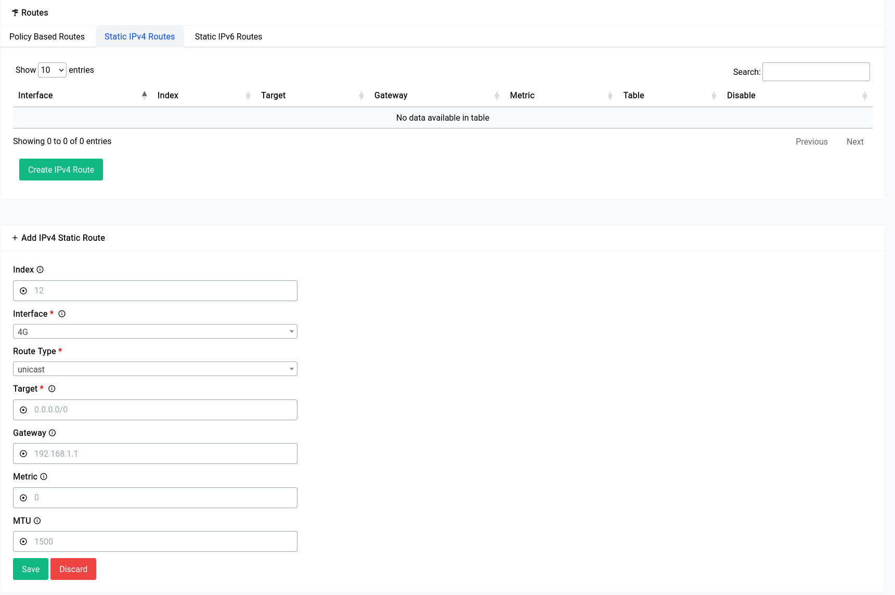

# Network Settings - Routes - Static IPv4

Static IPv4 routes are manually configured routes that are added to a router's routing table. These routes define how the router should forward traffic to specific IP addresses or network ranges.

When a packet arrives at a router, the router consults its routing table to determine how to forward the packet to its destination. If the destination matches a static route in the routing table, the router will use that route to forward the packet. If there is no matching static route, the router will use its default route to forward the packet.

Static routes are often used in situations where a network administrator wants to control how traffic is routed on a network. For example, a static route could be used to direct traffic from a specific subnet to a particular router, or to route traffic to a specific destination via a particular gateway.

