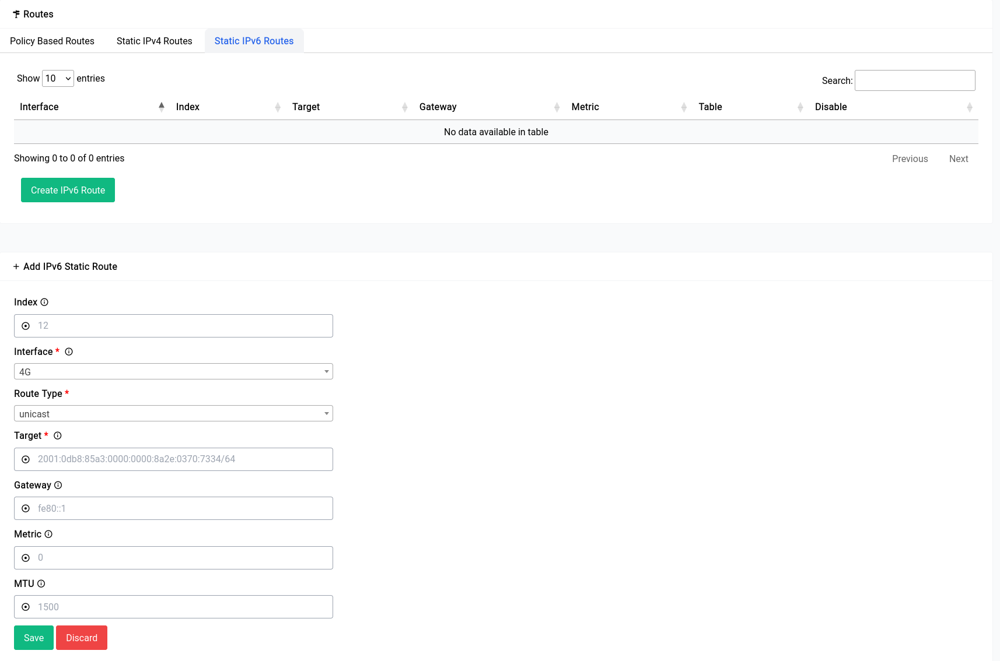

# Network Settings - Routes - Static IPv6

Static IPv6 routes are manually configured routes that are added to a router's routing table. These routes define how the router should forward traffic to specific IPv6 addresses or network prefixes.

When a packet arrives at a router, the router consults its routing table to determine how to forward the packet to its destination. If the destination matches a static route in the routing table, the router will use that route to forward the packet. If there is no matching static route, the router will use its default route to forward the packet.

Static routes for IPv6 are used in situations where a network administrator wants to control how traffic is routed on a network. For example, a static route could be used to direct traffic from a specific IPv6 subnet to a particular router, or to route traffic to a specific IPv6 destination via a particular gateway.

Unlike IPv4, IPv6 has no concept of a broadcast address, so the use of static routes to direct traffic to a specific broadcast address is not possible. Instead, IPv6 uses multicast addresses to deliver packets to multiple hosts. Static routes can still be used to route traffic to specific multicast groups.

