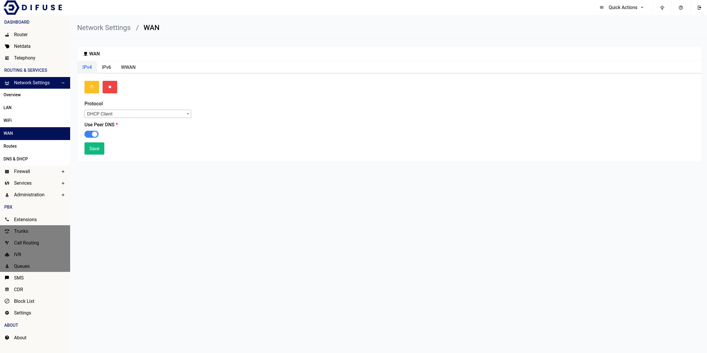
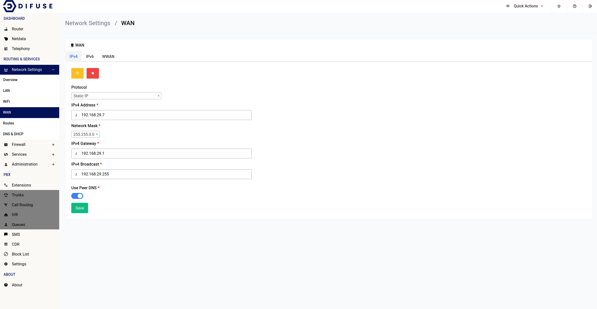
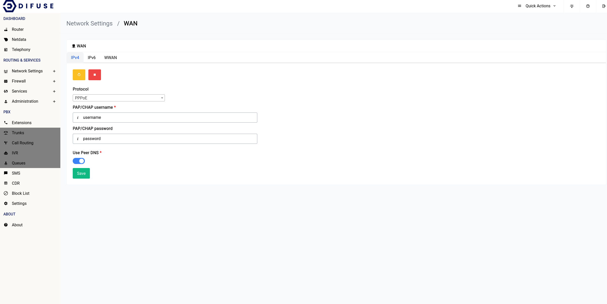

# Network Settings - WAN - IPv4 Configuration

There are 3 ways each for connecting to your IPv4 WAN connection:

- DHCP
- Static IP
- PPPoE

```admonish info
By default your device will be setup in DHCP mode, this is something you will have to change during the initial setup.
```

## DHCP

<a data-fancybox data-src="./img/1.png" data-caption="Network Settings - WAN - DHCP">
  
</a>

The DHCP Client is the most straight forward of the three and this is mostly used when you’re connecting your device behind another router, all you have to do is select the DHCP Client option in the protocol drop down and you’re good to go.

## Static IP

If you know the IP address, gateway, broadcast address and the upstream gateway doesn't support DHCP you should pick this option.

<a data-fancybox data-src="./img/2.png" data-caption="Network Settings - WAN - DHCP">
  
</a>

## PPPoE

For PPPoE things get a little interesting, once you enter in your details in the IPv4 section the IPv6 interface should get automatically configured using DHCPv6 and you need not do anything, this will be the case for a lot of ISP connections, but rarely you might need to do something special like configuring a Static IP.

```admonish note
The IPv6 interface when PPPoE is in use is an interface that is aliased to the initial WAN interface
```

<a data-fancybox data-src="./img/3.png" data-caption="Network Settings - WAN - DHCP">
  
</a>

