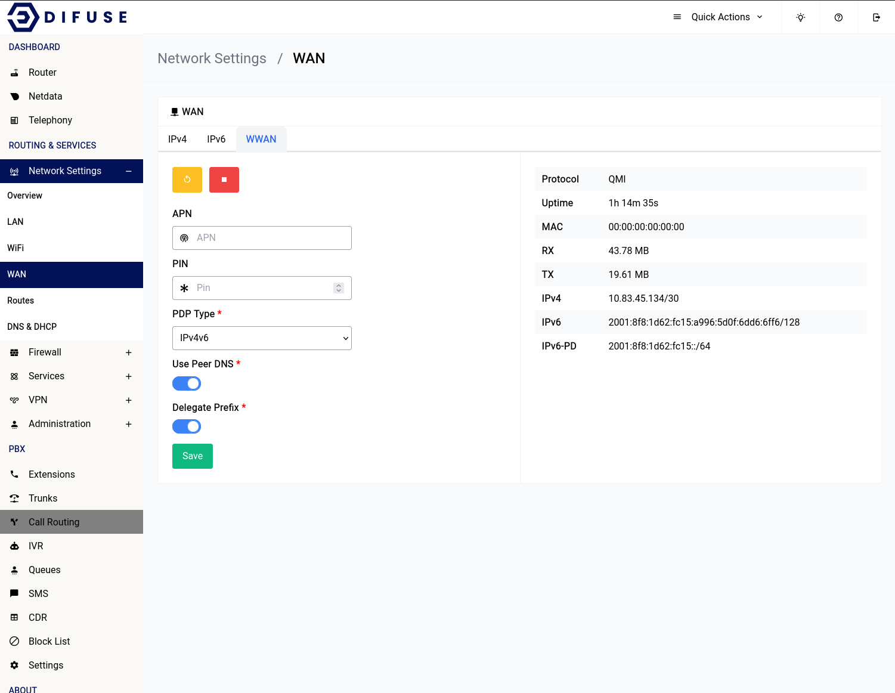

# Network Settings -  WWAN

```admonish info
This section is only applicable to you if you have a WWAN module in your system.
```

<a data-fancybox data-src="./img/7.png" data-caption="Network Settings - WAN - WWAN">
  
</a>

The WWAN connection usually doesn’t require any sort of configuration as the setup is done automatically. If your service provider requires an APN that needs to be setup or if your SIM card that is inserted has a PIN you can specify them here.