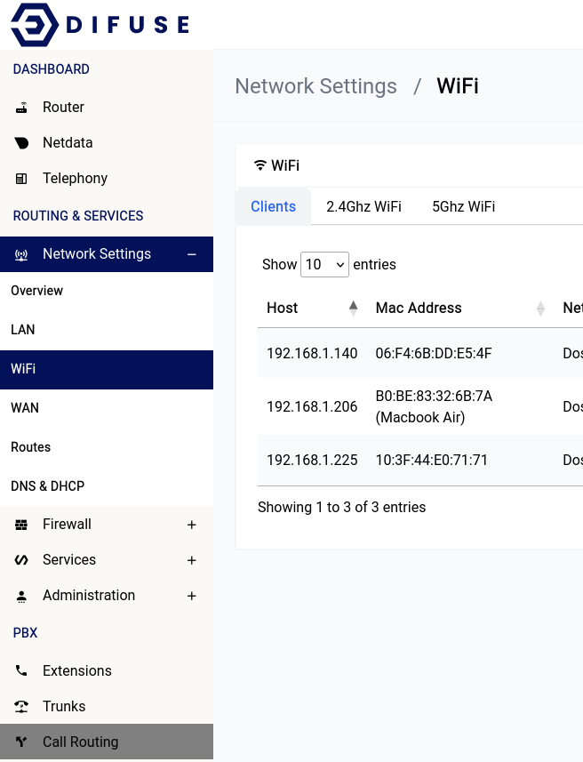

# Network Settings - WiFi

WiFi stands for Wireless Fidelity. This is the wireless interface on your router. You can configure the WiFi interface to broadcast a WiFi network and configure the SSID, password, channel, bandwidth etc.

WiFi configuration can be found in the Network Settings tab under the WiFi section.

