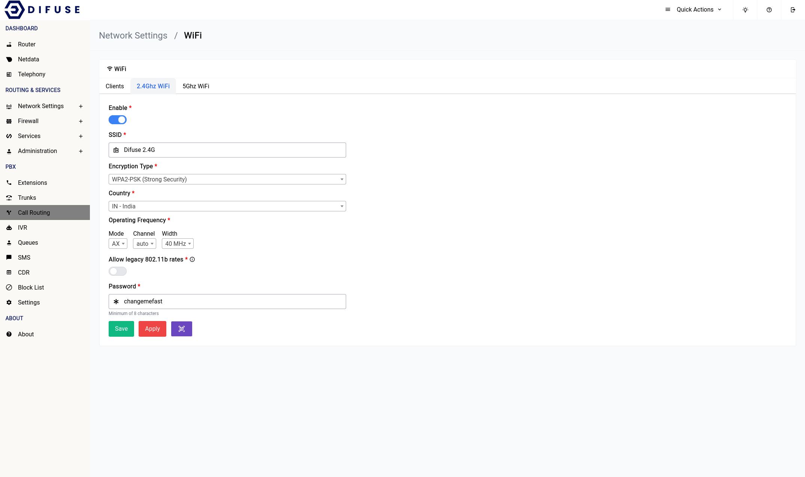

# Network Settings - WiFi - 2.4Ghz

<a data-fancybox data-src="./img/3.gif" data-caption="Network Settings - WiFi - 2.4Ghz">
  
</a>

```admonish note
Any changes to the 2.4GHz WiFi setting will require a save first then an apply for it to take effect.
```

Now let's go ever each of the settings and explain what they do.

## Enable

This option allows you to enable or disable the 2.4GHz WiFi interface.

## SSID

This is the name of the WiFi network that will be broadcasted by the router. You can change it to whatever you want.

## Encryption Type

We highly recommend that you use WPA3-PSK for the encryption type as it is the most secure. If you have older devices that don’t support WPA3 then you can use WPA2-PSK instead. WPA-PSK is **not** recommended as it is not secure.

If you want you can also select mixed mode which will allow devices that support WPA3 to connect using WPA3 and devices that don’t support WPA3 to connect using WPA2.

## Country

You should pick the country that you’re in for the country section, <b>never</b> choose the “00-World”. That option would force the system to apply all restrictions on the WiFi bands leaving only very few operational frequency ranges which is not optimal.

## Operating Frequency

It’s advisable to leave them at what they are but if you want to increase the range of your device’s WiFi signal you should choose the lower option of the two that are available (in the width section). The channel is automatically set to “auto” this would let the system use a channel that is the least crowded.

## Allowing legacy rates

802.11b rates should only ever be enabled if you have badly behaving clients that don’t play along with the WiFi network as it <b>significantly</b> reduces the airtime efficiency among other things.