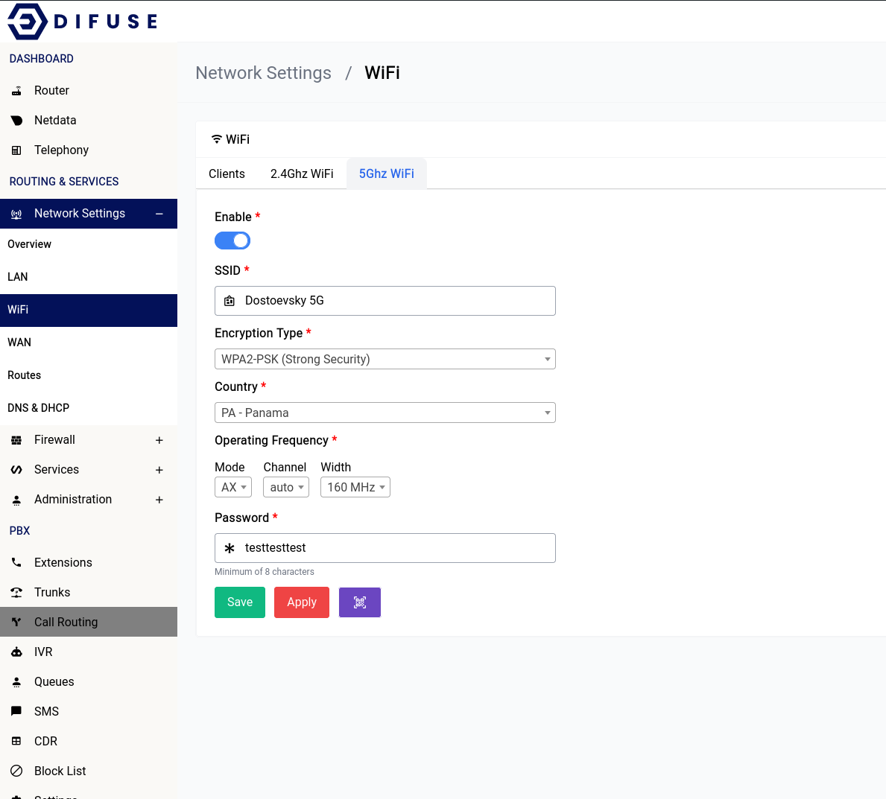

# Network Settings - WiFi - 5Ghz

<a data-fancybox data-src="./img/4.png" data-caption="Network Settings - WiFi - 5hz">
  
</a>

```admonish note
Any changes to the 5GHz WiFi setting will require a save first then an apply for it to take effect.
```

Now let's go ever each of the settings and explain what they do.

## Enable

This option allows you to enable or disable the 5GHz WiFi interface.

## SSID

This is the name of the WiFi network that will be broadcasted by the router. You can change it to whatever you want.

## Country

You should pick the country that you’re in for the country section, <b>never</b> choose the “00-World”. That option would force the system to apply all restrictions on the WiFi bands leaving only very few operational frequency ranges which is not optimal.

## Operating Frequency

It’s advisable to leave them at what they are but if you want to increase the range of your device’s WiFi signal you should choose the lower option of the two that are available (in the width section). The channel is automatically set to “auto” this would let the system use a channel that is the least crowded.