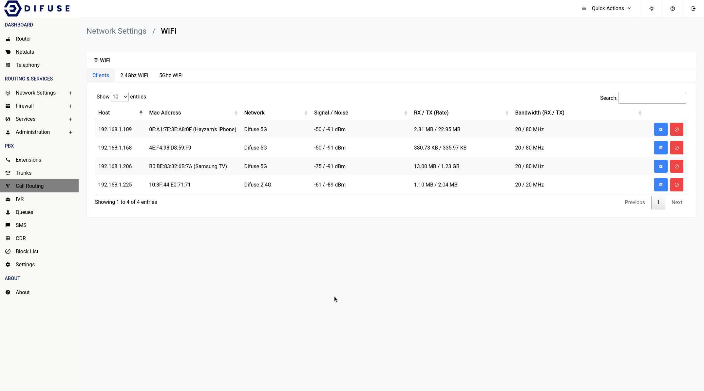
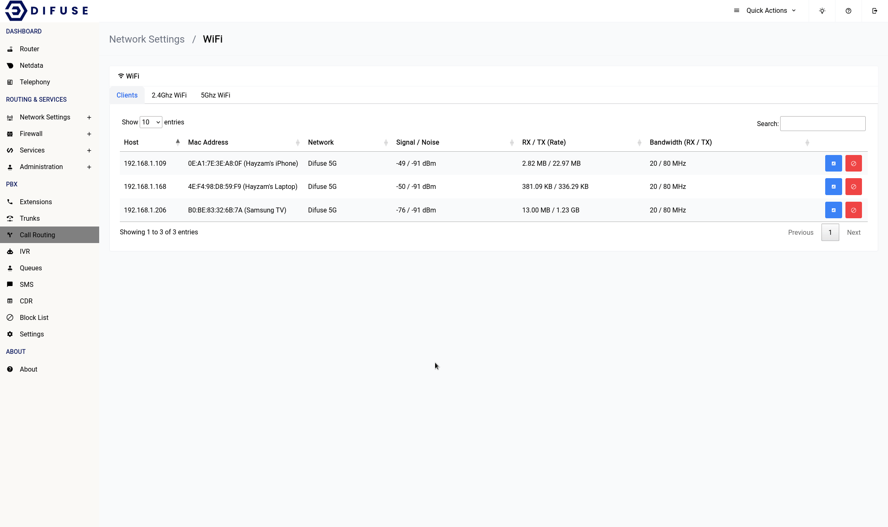

# Network Settings - WiFi - Clients

This page shows the list of clients connected to the router via WiFi.

When you first come across the page, you will notice a table of all connected devices, you can click on the blue icon to set an identifier for a specific MAC address. This will help you identify the device in the future.

<a data-fancybox data-src="./img/1.gif" data-caption="Network Settings - WiFi - Clients">
  
</a>

You can use the red block button to kick a client off the WiFi network for a specified time period.

<a data-fancybox data-src="./img/2.gif" data-caption="Network Settings - WiFi - Clients">
  
</a>

```admonish warning
The duration is reset once the device is rebooted before the time period expires
```

It’s also a good idea to keep an eye on which device is using which WiFi band since some very old devices perform poorly on the 5Ghz.