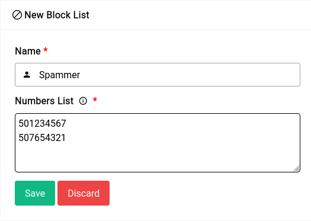

# PBX - Block List

A blocklist is nothing but a list of phone numbers or caller IDs that are prohibited from making inbound calls to a particular phone system or extension. When a call comes in from a number on the blocklist, the device will simply reject the call automatically, preventing it from ringing through to the intended recipient.

Blocklists are often used to filter out unwanted calls, such as telemarketers, spam callers, and other types of callers that nuisance and-or malicious categories. 

```admonish info
The Block List uses simple numbers instead of patterns this was done to make their setup as simple as possible.
```

Adding a new block list is super simple, all you have to do is click on the **Create New Block List** button and a form will come up:

<center>
    <a data-fancybox data-src="./img/16.png" data-caption="PBX - Block List - New Block List">
        
    </a>
</center>

## Name

Name is just an identifier for you to identify the list with.

## Numbers

The numbers list as you can see has 2 numbers, now if a caller make a call with the caller ID **+971501234567** or **+971507654321**, the calls will automatically be dropped as both those caller IDs contains strings that are to be blocked.

But for instance if they call from **0507654321** or **0501234567**, the call will not be dropped as it is technically not in the list.

A better option in cases like that would be to just specify **7654321** or **1234567**.