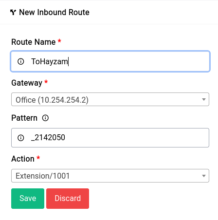
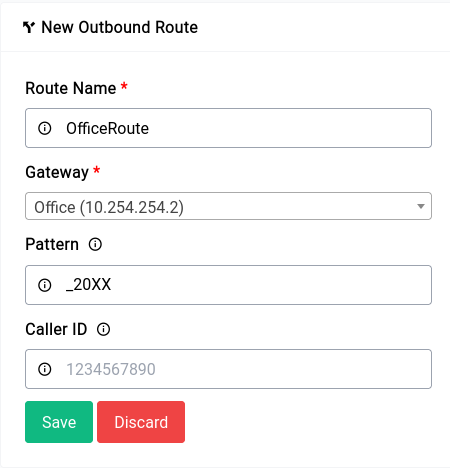

# PBX - Call Routing

Call routing directs incoming calls to the right person, department, or extension within an organization, while outbound routing directs outgoing calls to the appropriate external number or network. Both types of routing help businesses manage their calls efficiently and improve the caller experience.

To demonstrate we’ll be doing a few things:

1. Create an inbound route to route a call from one number to an extension
2. Create an outbound route that will take numbers having a specific pattern to a specific gateway

```admonish info
We have implemented our own version of Asterisk’s Pattern matching algorithm, please follow this excellent guide on setting up the right pattern for your route.
```

## Inbound Routing

Lets say you have a PRI or SIP trunk with the following pilot and DID numbers respectively

Pilot Number: **042142000**
DID Number: **042142000 - 042142099** (100 Numbers)

If you want to route the calls to the number 042142050 to the extension 1001 you’d create an inbound route like this:

<center>
    <a data-fancybox data-src="./img/5.png" data-caption="PBX - Call Routing - Inbound Route">
        
    </a>
</center>

You an notice in the pattern we’ve given **_2142050**, the default action can be pretty much anything from IVRs to Queues to extensions.

## Outbound Routing

Outbound call routing involves selecting the most appropriate outbound route for a call, based on factors such as cost, quality, and availability. This is typically done using a routing table or algorithm that determines the best route for each call.

For our example, we’re going to setup a route that will route all calls that starts with the pattern **_20XX** to go through the **Office** gateway that we have created earlier.

<center>
    <a data-fancybox data-src="./img/6.png" data-caption="PBX - Call Routing - Outbound Route">
        
    </a>
</center>

Normally, the Caller ID of the calling extension is passed through, but if you specify a Caller ID in this field, it will override the default Caller ID. Additionally, when creating the extension, you have the option to specify an outbound CID. If you have set an outbound CID, it will be used in the case of a Telecom-provided DID.