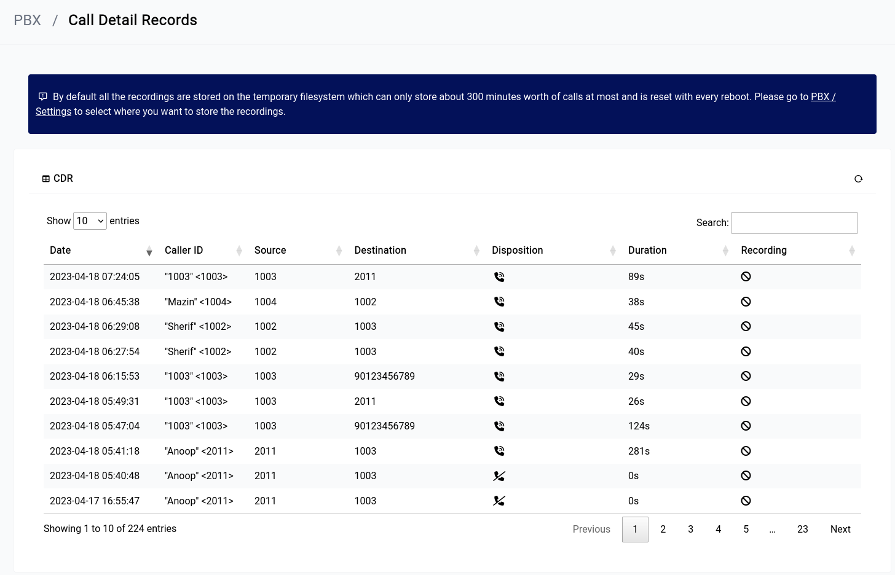

# PBX - Call Detail Records

The CDR in the GUI is automatically populated from data that comes from the asterisk database, if there’s recording enabled for an extension the download button will show up here.

    

As the alert message suggests it’s **not** a good idea to keep using the temporary file system for voice recordings, you should [use](/services/storage.html) a non-volatile storage for that purpose (either the M.2 SSD or an attached USB stick)