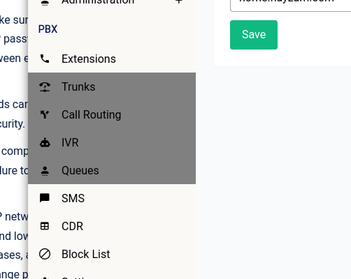
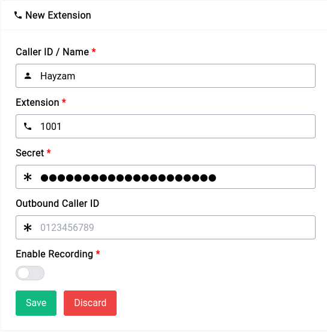

# PBX - Extensions

In any PBX system, extensions are a primary requirement. The process of creating an extension is straightforward with our GUI, as only a few parameters need to be filled in. You cannot add trunks, queues, or IVRs without first adding at least one extension, as all of those configurations require an extension to forward calls to.

<center>
    <a data-fancybox data-src="./img/1.gif" data-caption="No Extensions">
        
    </a>
</center>

## Adding an Extension

As aforementioned setting up an extension is **very** straight forward, all you need to do is click on the green **Create New Extension** button and fill in the blanks of the form that show’s up beneath the screen.

<center>
    <a data-fancybox data-src="./img/2.png" data-caption="PBX - Extensions - New Extension">
        
    </a>
</center>

Now let’s go through the form and see what each field does:

### Name

The name can be pretty much anything, but as always avoid spaces and keep it short.

### Extension

The extension has to be a valid number, in our case we’ve gone with 1001.

### Password

```admonish note
Check out [this](https://xkcd.com/936/) funny XKCD comic on a guide to create strong passwords.
```

Use **strong** passwords for SIP endpoints in Asterisk to prevent unauthorized access and protect sensitive information. Passwords should be 12-15 characters with a mix of upper/lower case letters, numbers, and special characters. Avoid common phrases, don't reuse passwords, and change them regularly.

### Outbound Caller ID

The Outbound Caller ID is only used for setting the caller ID while dialing outside world using a SIP or PRI trunk with DID (Direct Inward Dialing) Facility. In case of analogue trunks, this will be ignored by provider.

### Recording

As far as recording goes, if enabled you can see the recordings show up in the CDR page.