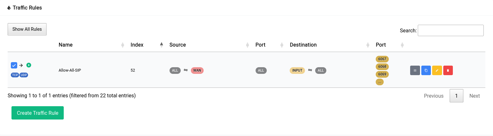
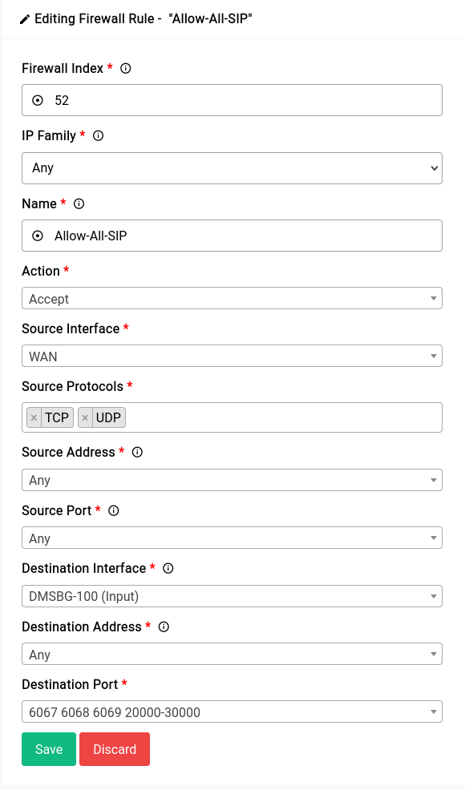
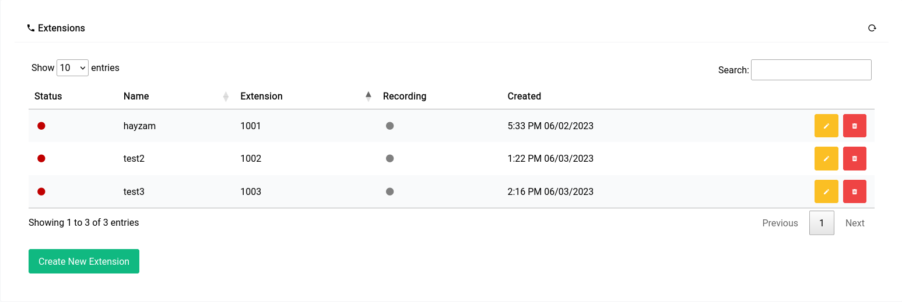

# PBX - Extensions - Softphones

## About Softphones

Softphones are software applications that run on your computer or mobile device and allow you to make and receive calls over the internet. They are a great alternative to traditional desk phones and can be used in conjunction with them.

There are some conditions that must be met in order for softphones to work properly with Difuse:

- Support for UDP/TCP or TLS SIP transport protocols.
- Support for the G.711u and G.711a audio codecs at the very least. (We recommend opus if available for better audio quality)
- Support for STUN, TURN or ICE for NAT traversal if you are behind a NAT.
- Optional but **very highly recommended** support for SRTP for secure audio transmission.

There are a lot of softphones on the market with only a few supporting the above mentioned functions and protocols in a reliable way. The ones that we know work well are:

<a style="font-size: 24px;" href="./softphones/acrobits.md">Acrobits</a>

Acrobits is a paid softphone that is available for Windows, macOS, iOS and Android. Their push notification service is extremely useful to save battery life on mobile devices. TLS and SRTP are supported flawlessly.

<a style="font-size: 24px;" href="./softphones/bria.md">Bria</a>

Bria is a paid softphone that is available for Windows, macOS, iOS and Android. Their push notification service is good but not as good as Acrobits. TLS SIP is supported well, but SRTP doesn't work properly on iOS (as of version 6.12.1 this may change in the future).

<a style="font-size: 24px;" href="./softphones/microsip.md">MicroSIP</a>

MicroSIP is the best free and open source softphone that we have found atleast on Windows. It supports all the protocols and codecs that we need and works well with Difuse.

<a style="font-size: 24px;" href="./softphones/blink.md">Blink</a>

Blink is also a free and open source softphone that is available for Windows, macOS and Linux. It supports all the protocols and codecs that we need and works well with Difuse. It's user interface is a bit difficult to use but it's a great softphone nonetheless.

This is a non-exhaustive list of softphones that we have tested and know work well with Difuse. If you have a softphone that you would like to use with Difuse and it's not on this list and has trouble working with Difuse please visit our [community forum](https://forum.difuse.io/) or [discord](https://discord.gg/X84tmX7N) and let us know so we can add it to the list.

## Pre-requisites for softphones

### Firewall

If you are using a softphone on a computer or mobile device that is connected to the same network as the Difuse router then you don't need to do anything. If you are using a softphone on a computer or mobile device that is connected to a different network than the Difuse router then you need to make sure that the firewall on the Difuse router is configured to allow traffic from the network that the softphone is connected to.

 

You need to allow ports **6067** (UDP Transport), **6068** (TCP Transport), **6069** (TLS Transport) and **20000-30000** (RTP) from the network that the softphone is connected to. It's pretty safe to allow all traffic from any network **if** you have intrusion detection enabled in Difuse as well as a strong password for the extensions. Above given is the rule that we're using for demostration but you can change it to suit your needs.

### Extensions

In the guides that we've written for each softphone, we're using the extension **1001** as an example. You can replace that with your own extension number.