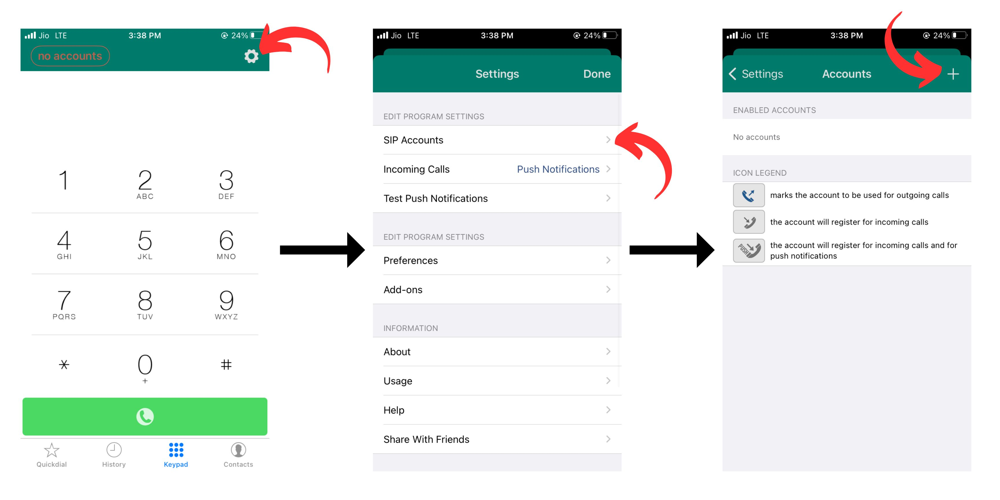
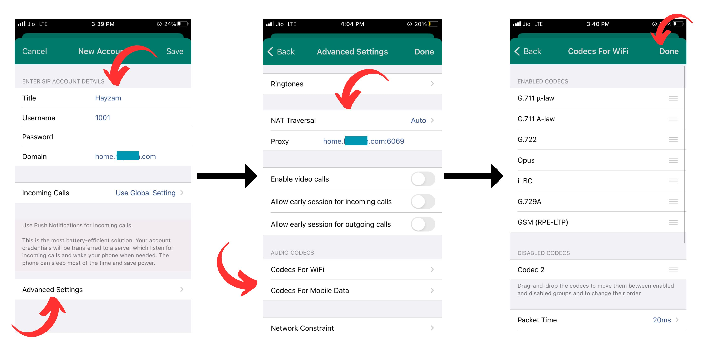

# PBX - Extensions - Softphones - Acrobits

[Acrobits](https://acrobits.net/) is pretty easy to setup with Difuse. In the following guide we're going to setup an extension on an iOS device, but the process is pretty much the same on all platforms.

## Setup

We're going to assume that you have already purchased and installed the Acrobits app on your device. If you haven't, you can find it on the [App Store](https://apps.apple.com/us/app/acrobits-softphone/id314192799) or [Google Play](https://play.google.com/store/apps/details?id=cz.acrobits.softphone.alien&hl=en&gl=US). As aforementioned this guide is for iOS but the process is pretty much the same on all platforms.

## Adding the extension

Click on the top-left gear icon to open the settings menu. Then click on the "SIP Accounts" option, after which you'll be presented with the accounts screen where you will see a "+" icon on the top-right corner. Click on it to add a new account.

Moving onto actually creating the extension:

### Basic Settings

In the "New Account" page there are a few entries to fill out:

- **Title**: This is not really important, it's just a name for the account for you to identify it.
- **Username**: This is the extension number that you want to add.
- **Password**: This is the extension's password.
- **Domain**: This is the IP address or FQDN of the PBX. If you're using the PBX's FQDN you should make sure that the PBX's certificate is valid and that the FQDN resolves to the correct IP address.

Once that's all filled out you can move on to the "Incoming Calls" section we've selected global settings but standard settings are also fine. As mentioned in the app it drains the battery a bit more but it allows you to receive calls even when the app is not running.

### Advanced Settings

Now moving on to the "Advanced Settings" section there's a lot of options here but we're only going to go over the ones that are the most important.

- **NAT Traversal** - This should be set to "Auto" as it will automatically detect if you're behind a NAT and use the appropriate method to connect to the PBX.
  
- **Proxy** - Specify the IP address or FQDN of the PBX here along with the port of the protocol you're using, we highly recommend to sticking with TLS as it's the most secure as well as the most resistant to censorship and the default TLS port is 6069, this is the port you should use unless you've changed it on Difuse.

- **Codecs** - We recommend using the same codecs for both WiFi and Mobile Data, but the choices are yours, all the codecs in the list are supported by Difuse.

- **Display Name** - This is the name that will be displayed on the other party's phone when you call them.
  
- **Auth Username** - This is the extension number that you want to add.
   
- **Transport Protocol** - This should be set to "TLS" as it's the most secure and the most resistant to censorship. But you can also use TCP or even UDP if you want to.
  
- **Secure Calling** - This should be set to "Enabled" and "Required" for both incoming and outgoing ideally. But if you're facing issues with it you can set it to "Enabled" and "Best Effort" for incoming and outgoing respectively.

Once you're done with all that you can click on the "Done" button on the top-right corner and you're done. You should now be able to make and receive calls using the extension you just added.