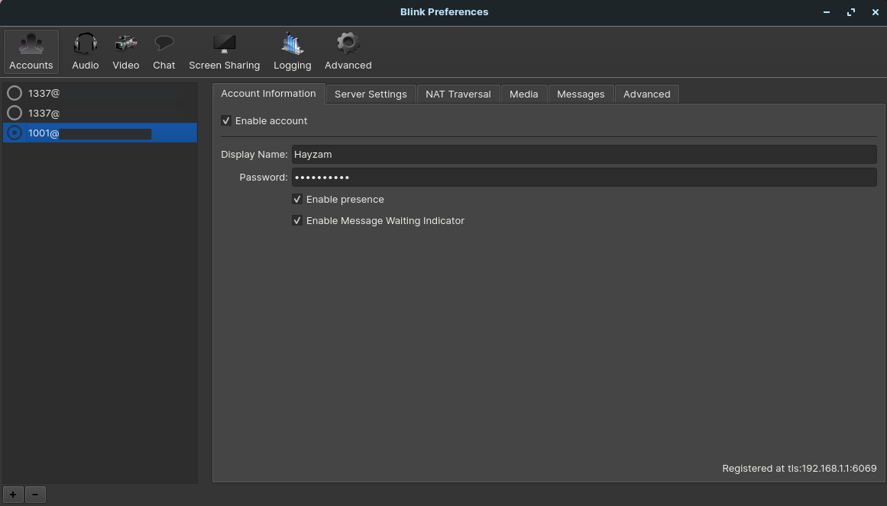
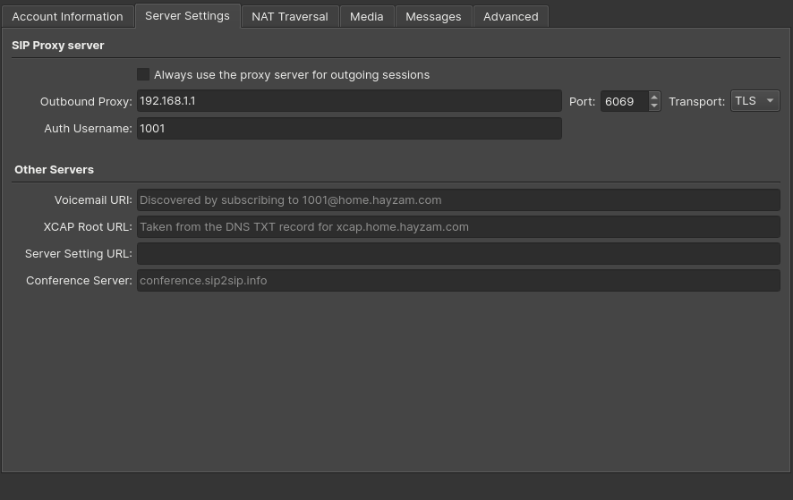
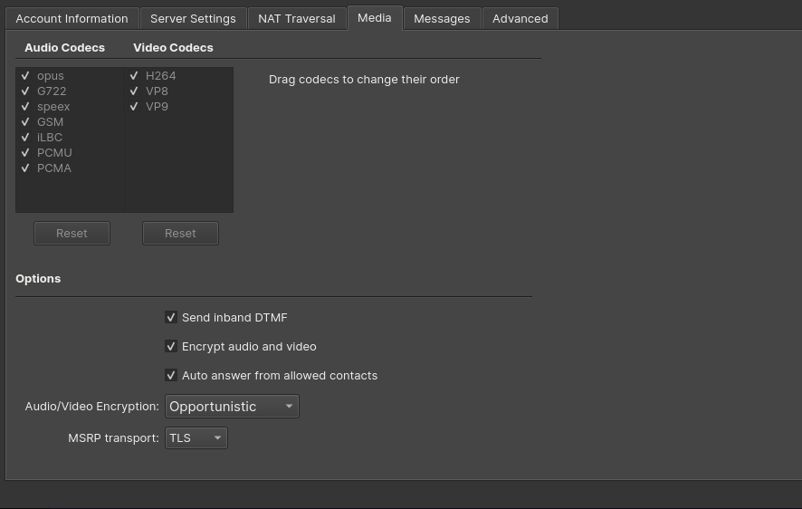
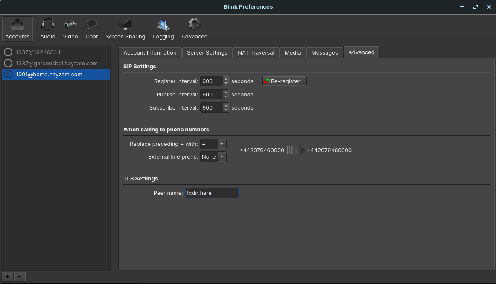

# Blink

Blink is a free (as in freedom) SIP client for Linux, Windows, and macOS. It is developed by [AG Projects](https://ag-projects.com/). It's mostly used on Linux, but it's also available for Windows and macOS. (Although we recommend MicroSIP for Windows)

## Setup

We're going to assume that you have already created a SIP extension in the PBX and also downloaded and installed Blink.

## Adding the extension

Open Blink and click on the **Accounts** tab. Click on the **+** button to add a new account. The SIP URI will be something like `sip:<extension>@domain.com`. Let's go over all the other settings:

- **Display Name**: The name that will be displayed on the phone when you call someone.
- **Password**: The password of the extension.

- **Outbound Proxy**: The IP address or FQDN of the PBX along with the port of the protocol you're using, we highly recommend to sticking with TLS as it's the most secure as well as the most resistant to censorship and the default TLS port is 6069, this is the port you should use unless you've changed it on Difuse.

- **Auth Username**: The extension itself.

- **Codec**: All the codecs are supported by Difuse, but we recommend using Opus as it's the most modern and efficient codec.
- **Audio Encryption** - We recommend setting this to Opportunistic, but if you want to be sure that your calls are encrypted you can set it to Mandatory.
- **MSRP Transport**: We recommend setting this to TLS.

You can click on the re-register button to make sure that everything is working correctly.

- **TLS Settings (Peer Name)** - This is the FQDN of the PBX, if you're using an IP address you can leave this blank.