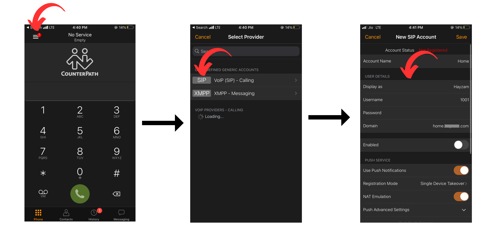

# Bria

Bria is a softphone application for Windows, macOS, iOS and Android. It is developed by CounterPath Corporation and is available for purchase on their website or on the respective app stores for mobile devices.

## Setup

We're going to assume that you have already installed Bria on your device and also that you've made an extension on the Difuse PBX. In this guide we're going to be setting up Bria Mobile on an iOS device, but the process is similar for other devices as well.

## Adding the extension

### Basic Settings

Click on the top left hamburger icon and you will be greeted by a page where you can add a provider, select "VoIP (SIP) - Calling" and you will go to another page where you can add a new account.

In the new page you will be presented with a few options to fill out:

- **Account Name**: This is not really important, it's just a name for the account for you to identify it.
  
- **Display As**: This is the name that will be displayed on the other party's phone when you call them.
  
- **Username**: This is the extension number that you want to add.
  
- **Password**: This is the extension's password.
  
- **Domain**: This is the IP address or FQDN of the PBX. If you're using the PBX's FQDN you should make sure that the PBX's certificate is valid and that the FQDN resolves to the correct IP address

- **Enabled**: Once you're done filling out the information you can enable the account and you should be able to make calls. But don't do this yet.

### Advanced Settings

- **Outbound Proxy**: This is the IP address or FQDN of the PBX. If you're using the PBX's FQDN you should make sure that the PBX's certificate is valid and that the FQDN resolves to the correct IP address along with the port number, we're using port 6069 which is the default port set by difuse for SIP over TLS but you can change it to whatever you want.

- **Incoming Calls**: This option is important if you want to receive calls on the extension. You should turn it on for receiving calls.

- **IP Version**: We **highly** recommend that you use IPv6 for the IP version as it saves a lot of headache when it comes to NAT traversal among other things, but if you don't have IPv6 connectivity you can use IPv4. Difuse out of the box supports the ability to use both IPv4 and IPv6 at the same time.

- **SIP Transport**: This is the protocol that will be used for SIP communication, we **highly** recommend that you use TLS as it is the most secure and it is less likely to be censored by ISPs. If you don't have TLS connectivity you can use TCP or UDP.

- **Encrypt Media**: We've set this option to "never" as there seems to be a bug in Bria that causes it to be able to make calls but not receive them if this option is set to "always". 

- **Verify TLS Certificate**: This option should be turned on if you're using TLS as the SIP transport, you can turn it off if your PBX's certificate is self-signed but we **highly** recommend that you use a valid certificate.