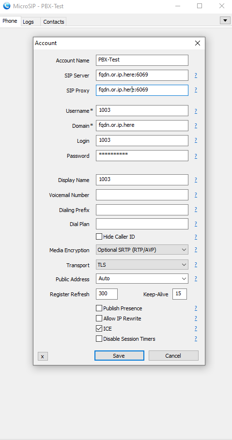

# MicroSIP

MicroSIP is a free SIP client for Windows. It is developed by [MicroSIP](https://www.microsip.org/). 

## Setup 

We're going to assume that you have already created a SIP extension in the PBX and also downloaded and installed MicroSIP.

## Adding the extension

Adding the extension is very trivial with MicroSIP, just open the program and click on **Add Account**. 

The above is what adding an account should look like, let's go over all the settings:

- **Account Name**: The name of the account, this is just for you to identify the account.
  
- **SIP Server**: The IP address or FQDN of the PBX along with the port of the protocol you're using, we highly recommend to sticking with TLS as it's the most secure as well as the most resistant to censorship and the default TLS port is 6069, this is the port you should use unless you've changed it on Difuse.
  
- **SIP Proxy**: This will be the same as the SIP Server.

- **Username**: The extension itself.

- **Domain**: The domain of the PBX, this is the same as the SIP Server.

- **Login**: The extension itself.

- **Password**: The password of the extension.

- **Display Name**: The name or number that will be displayed on the phone when you call someone.

- **Media Encryption**: We recommend setting this to Optional SRTP.

- **Transport**: We recommend setting this to TLS, you can also set it to TCP/UDP if you want to, but we don't recommend it.

- **NAT Traversal**: We recommend turning on the ICE checkbox.