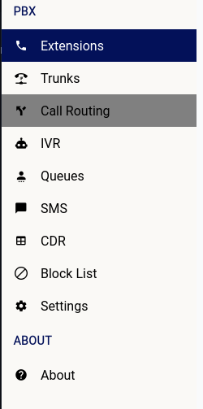

# PBX

    

Difuse leverages Asterisk as the core of the Telephony system. It’s packaged in a simple to use GUI, hiding all the complexities involved in setting up a PBX there by allowing non-IT staff to configure and manage the system.