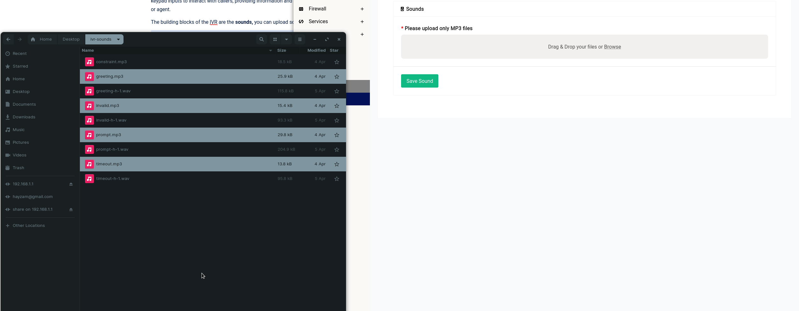
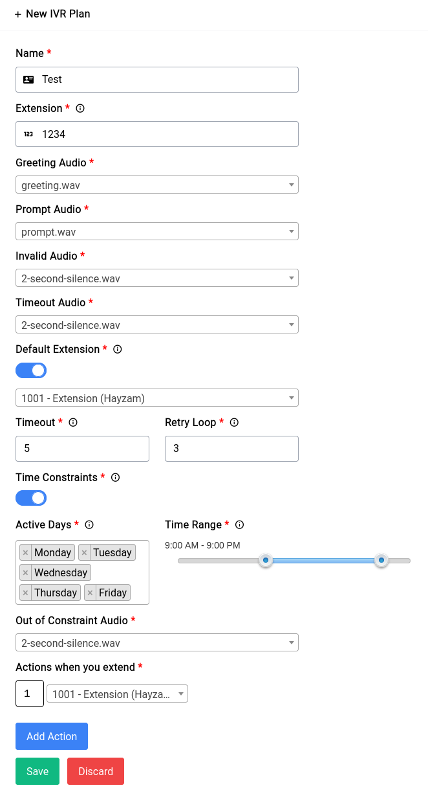
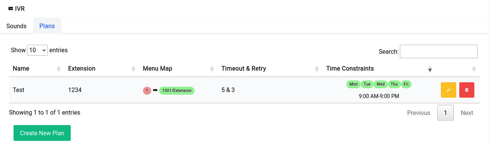

# PBX - IVR

IVR (Interactive Voice Response) is an automated telephony system that uses voice prompts and touch-tone keypad inputs to interact with callers, providing information and routing calls to the appropriate department or agent. 

The building blocks of the IVR are the sounds, you can upload sounds here and use it in your IVR menus.

```admonish tip
If you’re looking to generate high quality TTS, you can check out solutions like [this](http://play.ht/)
```

Now we’re going to do a few things:

1. Upload a bunch of different sounds for use with our IVR
2. Creating an IVR with the uploaded Sounds
3. Attached the newly created IVR to the LTE trunk.

## Uploading Sounds

To upload sounds you can switch to the Sounds tab in the IVR page drag and drop the MP3 files that you’d like to use in your IVR menus.

Example TTS in Text:

```text
Greeting: Hello, Welcome to our Office!
Prompt: Press 1 For Sales and Press 2 For Support.
Timeout: You have been timed out.
Invalid: That option is invalid.
Out of Constraint: Sorry, we're not operational today.
```

```admonish warning
You should **only** upload MP3 files, the device will take care of all the conversions for asterisk automatically.
```

You need not upload the sounds one by one, you can do them all together like this:

<center>
    <a data-fancybox data-src="./img/7.gif" data-caption="PBX - IVR - Sounds">
        
    </a>
</center>

Once the sounds are uploaded you can click on the Save Sound button and the newly uploaded sounds should show up in a table.

The sounds are now ready to be used in an IVR menu.

## Creating an IVR

To create an IVR menu, you can go into the **Plans** tab and click on the **Create New Plan** button. You should be greeted with the following form:

<center>
    <a data-fancybox data-src="./img/8.png" data-caption="PBX - IVR - New Plan">
        
    </a>
</center>

We’ve already filled in almost all details now let’s go over what these are.

### Name

The name is just one that you can use to identify the IVR with. 

### Extension

This is for you to call during testing among other things (you could forward to this number from another gateway if you’d like when a call arrives there)

### Audio(s)

The **Audio** suffixed options can all be populated with a sound file that you uploaded. It’s imperative that you use meaningful filenames so you know what is what.

### Default Extension

For our default extension we’ve specified one which is **Extension/1000**, this is so that if a call gets timed out for some reason (due to user inactivity perhaps) the call will still get through to an agent on our side. The timeout and retry loops as the nomenclature suggests times the user out if they didn’t submit an option to the IVR and retry loop is the number of times the IVR should play itself over again for the user to be able to submit an option.

### Time Constraints

We’ve selected time constraints and you have the option not to, time constraints are basically the time periods in which the calls received by the device should get through, we’ve selected **Mondays through Fridays from 9 AM to 9 PM** for testing purposes. Now the out of constraint audio option is the audio that plays when the call that is placed is outside of your operational time.


### Actions

This section allows you to specify what key entries will do what, now in our case we’ve only specified one action which is when the number **1** is entered by the caller, it should route the call to **Hayzam** who is on extension **1001**.

Once the IVR is setup, it should look something like this in the table:

<center>
    <a data-fancybox data-src="./img/9.png" data-caption="PBX - IVR - New Plan">
        
    </a>
</center>