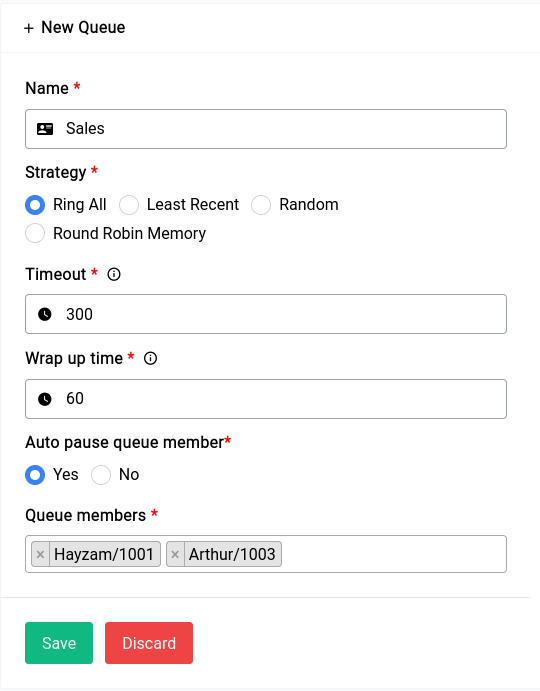
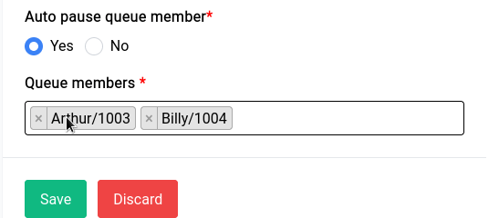

# PBX - Queues

Queues allow incoming calls to be distributed to a group of agents or extensions based on predefined rules. 

To create a new Queue all you have to do is click on the Create New Queue button in the Queues page, and the following form will pop up:

    

Let's go over the fields in the form:

## Name

Name is just an identifier for the Queue.

## Strategy

There are 4 different strategies you can choose from, we have chosen Ring All, here’s a brief description of all of them:

- **Ring All**: This is the default strategy, where all available agents are rung until someone answers the call.
- **Least Recent**: This strategy rings the agent who was least recently called by the queue.
- **Random**: This strategy as the name suggests will select a random member and pass down the call to them.
- **Round Robin Memory**: This strategy uses round-robin with memory, which remembers where the queue left off during the last ring pass.

## Timeout

This lets you set the amount of time (in seconds) a caller should be placed in the queue before being dropped, in this case we’ve selected 300.

## Wrap Up Time

Thsis refers to the amount of time (in seconds) an agent needs to complete after the end of a call before they can receive another call, in this case we’ve selected 60.

## Auto Pause

This option is a setting that determines whether to automatically pause an agent in a queue if they don't answer a call, it’s usually set to yes.

Now in the queue members you can add as many as you like, if you notice these members come from the **extensions** page.

    

