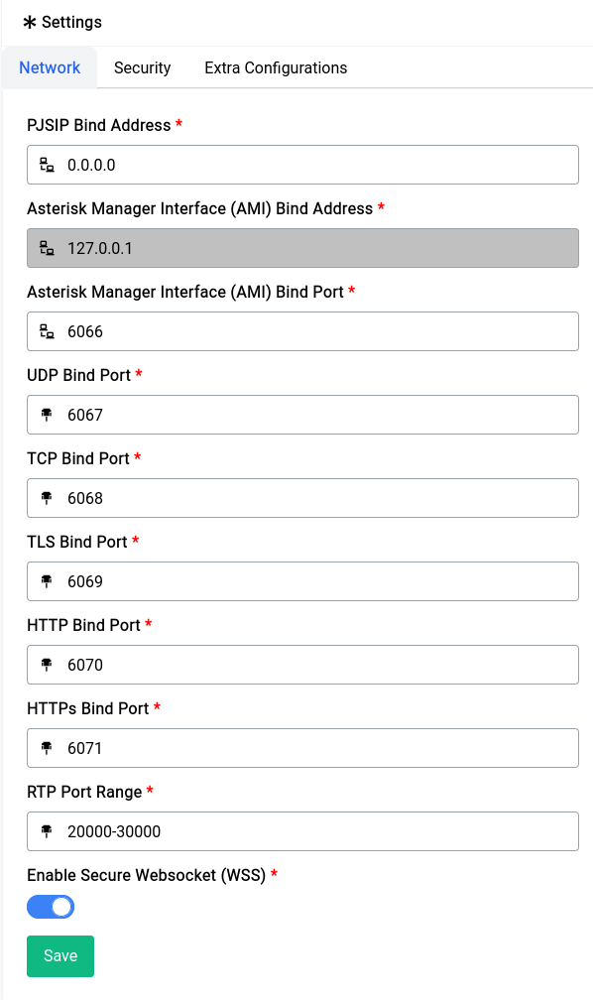
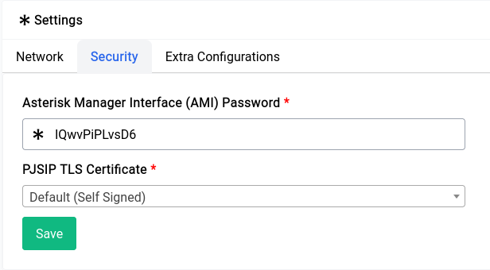
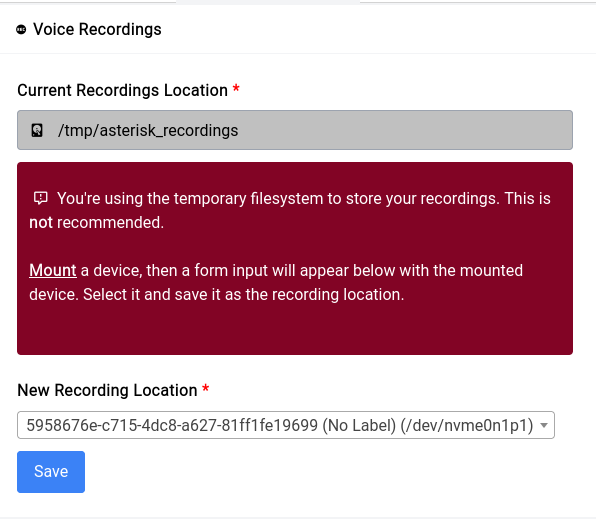
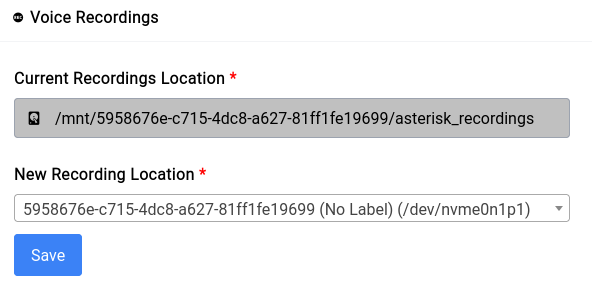
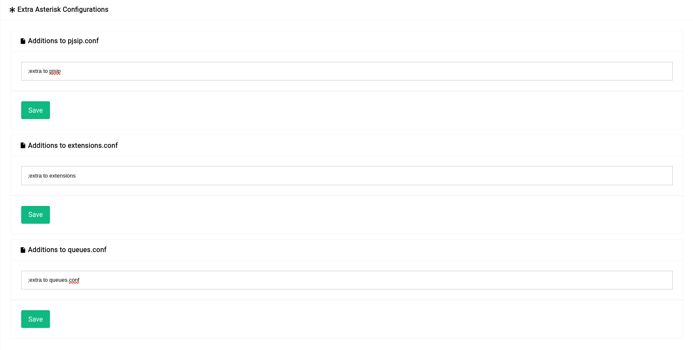

# PBX - Settings

This is where all asterisk related settings resides, there are 3 major sections:

- **Network**
- **Security**
- **Extras**

## Network

We **highly** recommend you keep these settings as they’re not really blocked by many ISPs for SIP/TLS SIP traffic neither are they used by script kiddies to target and hack into.

<center>
    <a data-fancybox data-src="./img/17.png" data-caption="PBX - Settings - Network">
        
    </a>
</center>

But if you want to change it in a way that makes configuration as simple as possible, use the following values:

```admonish warning
Changing the ports requires a PBX restart
```

| Type | Port |
|------|------|
| UDP  | 5060 |
| TLS  | 5061 |

## Security

In the Security tab you’ll see two options:

<center>
    <a data-fancybox data-src="./img/18.png" data-caption="PBX - Settings - Security">
        
    </a>
</center>

```admonish warning
Changing the AMI password requires a GUI and PBX restart
```

The AMI password is that for the asterisk manager that the device uses to communicate with the asterisk service underneath, it’s **recommended** to change it especially if you’re planning on keeping the device open to the internet.

The PJSIP TLS Certificate is the certificate that will be used for encryption on calls, as discussed in the [ACME Certificates](/services/acme-certificates.html) section you can set one up here and asterisk will automatically start using it for calls.

## Extras

### Voice Recordings

By default all voice recordings are stored on volatile memory (RAM) which will be cleared when the disk space is severely limited or during a restart, this is not ideal as you would constantly lose recordings of calls.

<center>
    <a data-fancybox data-src="./img/19.png" data-caption="PBX - Settings - Extras - Voice Recordings">
        
    </a>
</center>

To fix this issue you could mount the M.2 SSD (in case your device has one) or a USB stick and use that to store your recordings. Once you mount the drive it should look something like the above and clicking on save will result in the section looking a lot less scarier.

<center>
    <a data-fancybox data-src="./img/20.png" data-caption="PBX - Settings - Extras - Voice Recordings Location">
        
    </a>
</center>

It will automatically create a folder named **asterisk_recordings** upon save and you don’t have to worry about that.

### Additions to Asterisk Configs

The device manipulates all the asterisk configurations in their default locations and editing them directly somehow on your own is a **very** bad idea. Instead you can use the **Extra** sections in this page to add all the extra configs that you want to **pjsip.conf**, **extensions.conf** and **queues.conf** respectively:

<center>
    <a data-fancybox data-src="./img/21.png" data-caption="PBX - Settings - Extras - Additions to Asterisk Configs">
        
    </a>
</center>

This will be appended to the asterisk configurations.