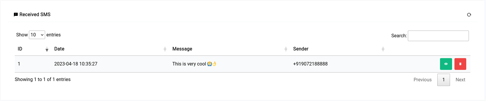
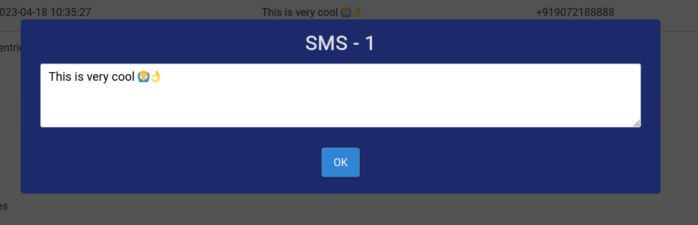
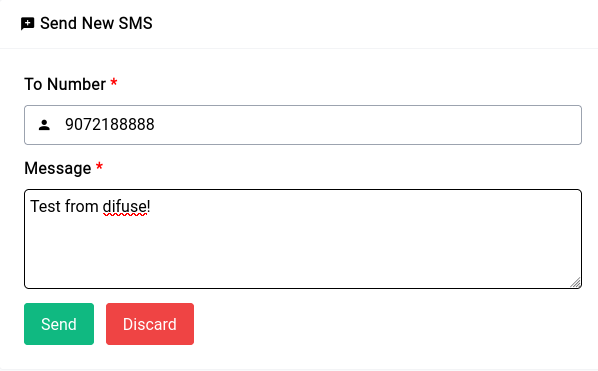

# PBX - SMS

```admonish info
You need an LTE module along with a functional SIM card with enough balance to make any of the things in this section work.
```

## Receiving SMS

Any SMS that is received while the device is turned on and the SIM card is initialized will show up in the table on top:

<center>
    <a data-fancybox data-src="./img/12.png" data-caption="PBX - SMS - Received SMS">
        
    </a>
</center>

If the message is longer than 30 characters the text is truncated in the table but if you click on the green eye icon you can see the full message.

<center>
    <a data-fancybox data-src="./img/13.png" data-caption="PBX - SMS - Received SMS - Full Message">
        
    </a>
</center>

## Sending SMS

```admonish warning
You need enough balance with your carrier to be able to send SMS (sometimes even receive them)
```

Sending SMS can be done by clicking on the New SMS button and filling out the form.

<center>
    <a data-fancybox data-src="./img/14.png" data-caption="PBX - SMS - New SMS">
        
    </a>
</center>

The system used underneath is **asterisk**, so sometimes even if asterisk considers the SMS to be sent, your provider might have dropped it without giving a notice, in that case the device will still consider the SMS sent but in actuality it would’ve never been sent.

You can also use the [API](/api/index.html) to send and receive SMS.