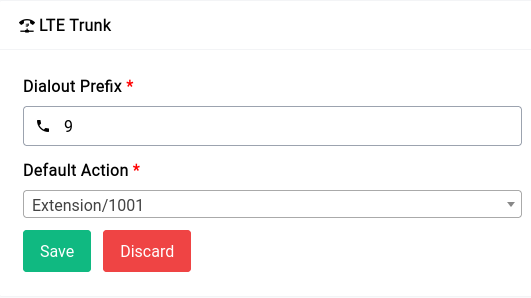
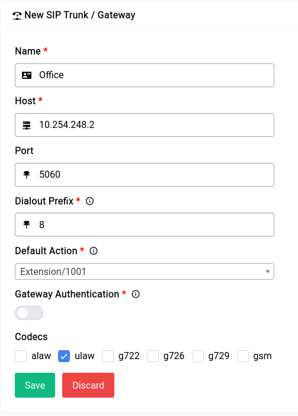

# PBX - Trunks

SIP trunks transmit voice and video data over IP networks and offer a cost-effective alternative to traditional telephone lines. Interoperability with other communication systems is important and can be affected by protocol, codec, and feature compatibility. To ensure successful communication, work with a provider that offers compatibility testing and support.

The device has been tested with most Asterisk based Analogue Gateways and proprietary systems like Avaya, Cisco etc. In short, the device works with any gateway that is supported by Asterisk itself.

Now for purposes of demonstration we’re going to do a few things:

1. Set up the LTE trunk and attach an extension to it for receiving calls as well make a test call to the outside world using it.
2. Set up a simple trunk for use with Difuse.

# LTE Trunk

```admonish info
This is **only** applicable if you have an LTE module in your device
```

Setting up the LTE trunk is done by clicking on the **Edit LTE Trunk** button in the Trunks page.

<center>
    <a data-fancybox data-src="./img/3.png" data-caption="PBX - Trunks - LTE Trunk">
        
    </a>
</center>

Now we’ve given **9** as our dialout prefix and **Extension/1000** as our default action, the default action can pretty much be anything (IVRs or Queues or just Extensions) for simplicity we’ve chosen the extension 1000 to redirect all the calls to.

Now from our Softphone which is registered with our PBX we can make a call by dialing 9`<number>`, so if the number you want to dial is **9072188777** you would dial **99072188777**.

## SIP Trunk

Setting up a regular trunk is a little more complicated in comparison to the LTE trunk but still pretty easy as there are not many options. You can click on the green **Create New Trunk** button to start creating a new trunk.

<center>
    <a data-fancybox data-src="./img/4.png" data-caption="PBX - Trunks - New Trunk">
        
    </a>
</center>

The above given is the configuration for a barebones SIP trunk (also running asterisk).

Now let's go through the form and see what each field does:

### Name

The name is just an identifier for you to keep track of.

### Host

The host is the IP address of the device that you’re going to be connecting to, in our case it’s **10.254.248.2** The port is bog standard **5060** but it may be different in your case be sure to check on that in case of troubleshooting.

### Dialout Prefix

this is what you would use to dial the outside world from your PBX similar to the one in the LTE Trunk. In our case it’s 8, so if we want to dial outside using the Office trunk we would use the number 8`<number>`. 

### Default Action

This is what the device will do when a call is received on this specific trunk, you can set it to anything from **IVR** to **Queues** to **Extensions**. This depends entirely on your usecase. 

### Gateway Authentication

If you enable Gateway Authentication, you need to fill in the details which will be provided to you by the SIP provider or the gateway configuration.

### Codecs

Codecs are used to encode and decode the audio data, the device supports a wide variety of codecs, but for the sake of simplicity we’ve gone with the most common one.

----

Now coming to the configuration on the gateway (10.254.248.2), it would look something like this, in case of sip.conf and pjsip.conf respectively:

```
;sip.conf

[sip-difuse]
type=peer
insecure = port,invite
qualify=yes
host=10.254.248.1 (you can specify your-device-ip-address)
port=6067
context=sip-difuse
```

```
;pjsip.conf

;pjsip.conf

[transport-udp]
type=transport
protocol=udp
bind=0.0.0.0

[sip-difuse]
type=endpoint
transport=transport-udp
insecure=port,invite
qualify=yes
host=10.254.248.1
port=5060
context=sip-difuse
```

In the extensions.conf you would have something like this:

```
;extensions.conf

[sip-difuse]
exten => _050XXXXXXXXX,1,Dial(DAHDI/${EXTEN})
exten => _050XXXXXXXXX,n,Hangup()
```

In our example we’re using the context name `sip-difuse` you can define your own, now in practice what should happen is when a call is initiated with the dialout prefix **8** as in our example it should go to this trunk, our device **truncates** the prefix before sending it to the other gateway so on the other side if you dial **8050123456789**, it will only see **050123456789**.