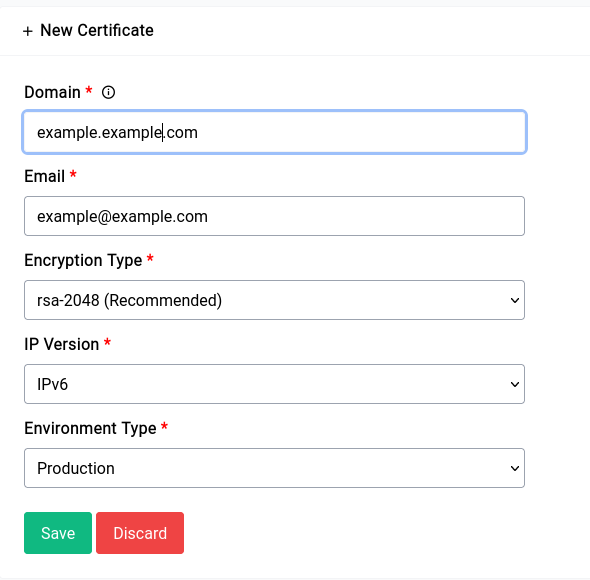
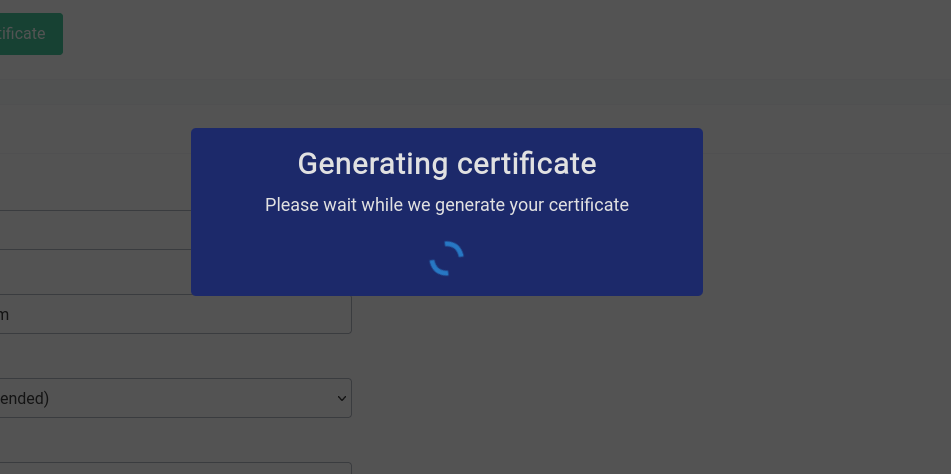
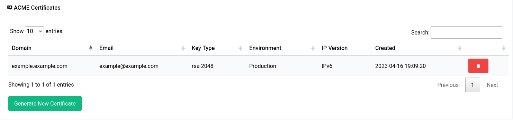
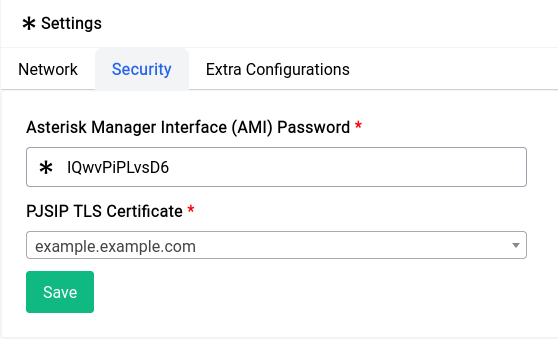
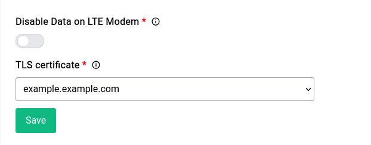

# Services - ACME Certificates

Two services namely the Difuse GUI and Asterisk PBX software uses TLS certificates for encryption. The device from the factory comes with a self-signed certificate. As you may already know self-signed certificates cause warnings generated on the client side and sometimes the certificate doesn’t work at all in the case of some soft phones to mitigate this the ACME certificates service comes into play.

```admonish quote
ACME, or Automated Certificate Management Environment, is a protocol that makes it possible to automate the issuance and renewal of certificates, all without human interaction.
```

Now we’re going to use ACME to generate **Let’s Encrypt** certificates and use it for both our GUI as well as Asterisk.

To set up a certificate you **need** to have a domain name setup already, please follow the Dynamic DNS Service guide for doing that. Once that is set up you can start the setup process as that page will no longer have a disabled link button.

## Creating Certificates

<center>
<a data-fancybox data-src="./img/1.png" data-caption="Services - ACME Certificates - Creating a Certificate">
  
</a>
</center>

Let's go over the fields:

### Domain

You can use the domain name you had set up in the dynamic DNS service page.

### Email

You need to specify a **valid** email address here, this is used by Let's Encrypt to send you notifications about your certificate.

### Encryption Type

**ec-256** is orders of magnitude faster than **RSA-2048**, but that being said it is also not the most widely supported encryption type across all the asterisk clients whereas RSA-2048 is. Which is congruently the reason why we recommend it.

### IP Version

Coming to IP version it’s a very good idea to use the option which makes the most sense to you. If you’re under **strict** CGNAT it’s mandatory to run the generation on IPv6 as the CGNAT IP is not globally routable whereas the IPv6 is but if you have a regular dynamic or static IPv4 address you can pick that.

```admonish warn
If you have both A and AAAA records on your domain ACME servers might randomly pick one to query, you can try both IP versions one after the other if either doesn’t work the first time.
```

### Enviroment Type

If you want to test the generation it’s a very good idea to set the environment type to **staging** and try generating a few times before you try out production since failing a few times on production will put you on a black list for a few hours during which you will not be able to verify/generate any new certificates.

----

Generation of a new certificate will take a long time, which is around 2-3 minutes or sometimes even 5-10 minutes depending on factors such as your network speed, the load on ACME servers etc.

It will look something like this:

<center>
<a data-fancybox data-src="./img/2.png" data-caption="Services - ACME Certificates - Generating a Certificate">
  
</a>
</center>

Once it’s all set up, the table should look something like this:

<a data-fancybox data-src="./img/3.png" data-caption="Services - ACME Certificates - Certificate Table">
  
</a>

## Using Certificates

### Using Certificate for Asterisk

Setting up the ACME generated certificate for asterisk is trivial. Go into **Settings** under the **PBX** section and then into the **Security** tab where you will find 2 options one is for the AMI password and the other is for **PJSIP TLS Certificate**.

<center>
<a data-fancybox data-src="./img/4.png" data-caption="Services - ACME Certificates - Asterisk Security Settings">
  
</a>
</center>

Now asterisk will start using that certificate for TLS. If you want to make sure that it applied you can always restart and-or reload the configuration using the **Quick Actions** menu.


### Using Certificate for Difuse GUI

This is not really necessary but it’s a really cool thing to have, especially if you do a lot of remote administration. Just like the TLS setup for asterisk you can go into the Administration section under Routing & Services section and then go into the Miscellaneous tab.

```admonish warn
Certificate change for GUI will need a restart to take effect
```

In the **Miscellaneous** tab you will find the **TLS certificate** option, you can specify the certificate you generated and save. 

<center>
<a data-fancybox data-src="./img/5.png" data-caption="Services - ACME Certificates - Difuse GUI Security Settings">
  
</a>
</center>