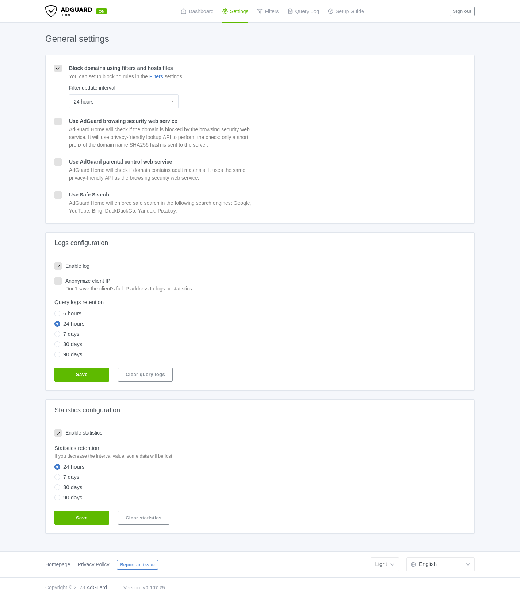

# Services - AdBlock & Content Filtering

Adblock & Content Filtering is an extension to the underlying DNS server that allows you to block ads and other unwanted content on your network. 

There are 3 tabs in this service:

1. **Basic** - This tab allows you to start/stop the service and choose the the categories of sites you want to block.
2. **Advanced** - This tab allows you to add custom domains to block.
3. **Reports** - This tab allows you to see the blocked domains and the queries that were blocked along with all the queries that were made to the DNS server.

```admonish warn
If you use IPv6 using DHCP relay on your network, all the DNS traffic **will not** be queried to the local DNS server, instead it will be sent to the upstream DNS server. This is a limitation of the DHCP relay protocol. You have to manually set the DNS server on your clients to the local DNS server.
```

## Basic

In the basics tab as the name suggests you can setup the basic settings of the underlying adblock instance. In Difuse, adblock works by hijacking DNS requests from the client and returning an NXDOMAIN for blocked domain names.

You can pick the site categories that you want to block from the dropdown box as shown below and click on save.

<a data-fancybox data-src="./img/6.png" data-caption="Services - Adblock & Content Filtering - Basic">
  
</a>

We use the lists that are provided by [The Block List Project](https://github.com/blocklistproject/Lists) and the lists are updated frequently by the underlying adblock service (if you selected a particular list). You can always just not use it by not selecting anything from the dropdown menu.

## Advanced

Going beyond the basic settings, in the Advanced tab, you can setup your own domains to block.

For our example we’ve picked getmonero.org, to block it all you need to do is this and save:

<center>
<a data-fancybox data-src="./img/7.png" data-caption="Services - Adblock & Content Filtering - Advanced">
  
</a>
</center>

After a few minutes all the clients that try to get to that URL will get a similar message:

<a data-fancybox data-src="./img/8.png" data-caption="Services - Adblock & Content Filtering - Advanced">
  
</a>

## Reports

The Report section has a lot of information namely some cool statistics drawn from query data as well as the DNS query data themselves. 

If you’re an employer please keep in mind the [privacy laws](https://en.wikipedia.org/wiki/Privacy_law) in your country before you use this data.

In the first section of the reports page you can see some statistics about the number of queries done. This number might seem low, it doesn’t count the number of queries for the same domain in the same time period, for instance if someone queried **facebook.com** it wouldn’t count the number of A and AAAA record queries instead it will just count as one query.

<a data-fancybox data-src="./img/9.png" data-caption="Services - Adblock & Content Filtering - Reports">
  
</a>

The blocked and failed count as the name suggests counts the number of blocked and failed queries done on the DNS server.

Coming to the second section you can see a pretty extensive table with a lot of data, this is query data, to be more precise the query data of all the different clients on your network.

<a data-fancybox data-src="./img/10.png" data-caption="Services - Adblock & Content Filtering - Reports">
  
</a>

You can choose to export data for selected entries if need be or just query through them using the table options.