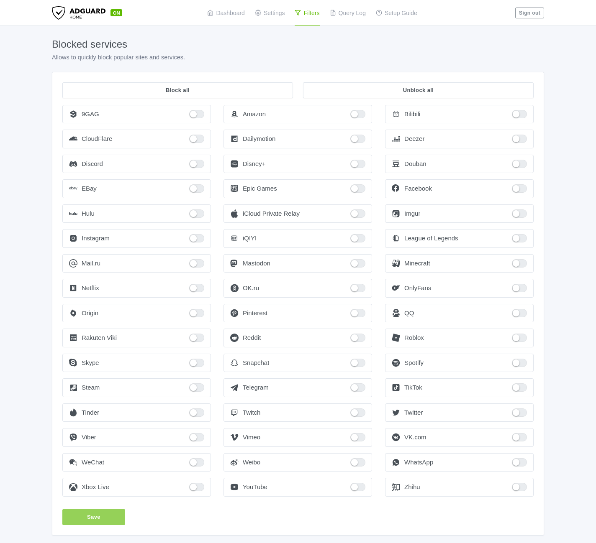
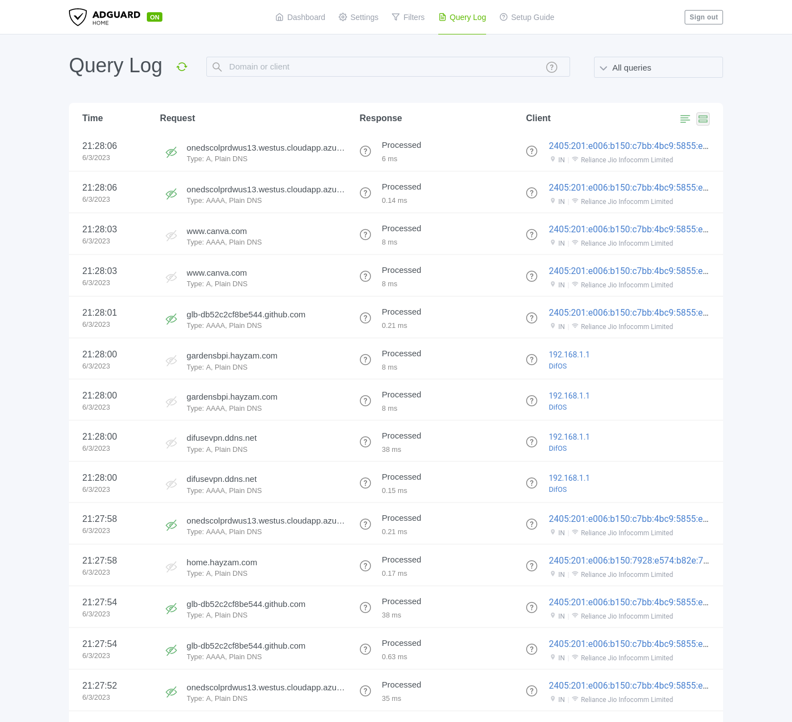

# AdGuard Home

[AdGuard Home](https://adguard.com/en/adguard-home/overview.html) is a network-wide software for blocking ads & other unwanted content. The software is free and open source. Difuse comes pre-installed with AdGuard Home and it is enabled by default and used as the DNS resolver for the LAN. AdGuard offers great documentation [here](https://github.com/AdguardTeam/AdGuardHome/wiki/Clients). Some commonly used features are listed below.

```admonish warning
You **should not** use the DHCP server present in the AdGuard Home web interface as it will conflict with the DHCP server that we use which is dnsmasq. 
```

## Accessing AdGuard Home

<a data-fancybox data-src="./img/6.png" data-caption="Services - AdGuard">
  
</a>

AdGuard Home is accessible via the web interface at `http://<router-ip>:1887`, where `<router-ip>` is the IP address of the router. You can also access it via the `Services` menu in the web interface which should automatically redirect you to the AdGuard Home web interface.

The password is the same as your router password, it automatically changes when you change that password.

## Commonly Used Features

### General Settings

In the general settings tab, there are 3 main sections:

1. **Basic Settings**: This is where you can turn on/and off things like parental control web interface, safe search, etc.
   
2. **Logs & Statistics Configuration**: We recommend you to keep the logs enabled and with a low retention period since this is stored on the eMMC and it can fill up pretty quickly especially if you have a lot of clients on your network.

### DNS Settings

In the Upstream DNS settings, the following is defined:

```
[/pool.ntp.org/]1.1.1.1
[/pool.ntp.org/]1.0.0.1
[/pool.ntp.org/]2606:4700:4700::1111
[/pool.ntp.org/]2606:4700:4700::1001
[/difuse.io/]1.1.1.1
[/onion/]127.0.0.1:9053
https://dns.cloudflare.com/dns-query
https://dns.quad9.net/dns-query
https://doh.mullvad.net/dns-query
https://dns.google/dns-query
```

We **highly** recommend just keeping it the way it is as it is the best configuration for most users. If you want to add your own upstream DNS servers, you can do so by adding them to the end of the list. You can also remove any of the upstream DNS servers that you don't want to use.

```admonish warn
Since the device doesn't have an onboard RTC, it uses NTP to sync the time. If you remove the NTP servers from the upstream DNS list, the time **will not** be synced because the device will not be able to resolve the NTP servers with just the DNS-over-HTTPS servers.
```

We also have kept "parallel requests" enabled by default. This means that the device will send DNS requests to all the upstream DNS servers at the same time and use the fastest response. This is a great feature to have enabled as it makes the DNS resolution faster and more reliable.

### DNS Blocklists

By default AdGuard comes with 2 blocklists namely:

1. AdGuard DNS filter
2. AdAway Default Blocklist

We have enabled only the AdGuard DNS filter by default. You can enable the AdAway Default Blocklist if you want to block more ads but we've found that it can sometimes block legitimate content as well, the choice is yours.

### DNS Allowlists

You can add your own allowlists here if you want to allow certain domains that are blocked by the blocklists.

### DNS Rewrites

<a data-fancybox data-src="./img/8.png" data-caption="Services - AdGuard - DNS Rewrites">
  
</a>

You can add your own rewrites here if you want to rewrite certain domains to other domains or return a different IP address for a domain or even return only AAAA records for a domain. The possibilities are endless. If you use policy based routing you can see that there may be domains that you've specified in the Difuse GUI present here, this is because the rewrite functionality is implemented using DNS rewrites (to return only A records for policy routed domains).

### Blocked Services

<a data-fancybox data-src="./img/9.png" data-caption="Services - AdGuard - Blocked Services">
  
</a>

You can block certain services here. For example, if you want to block all the Facebook services you can just enable the button next to Facebook and it will block all the Facebook services. Be careful with this as it can break certain websites.

### Custom Filtering Rules

You can specicy all your custom filtering rules here. 

<a data-fancybox data-src="./img/10.png" data-caption="Services - AdGuard - Custom Filtering Rules">
  
</a>

As you can see we've allowed all for the LAN IP 192.168.1.202, it's a good idea to specify IPv6 address of the client as well if you want to allow it for IPv6 as well.

### Query Log

<a data-fancybox data-src="./img/44.png" data-caption="Services - AdGuard - Query Log">
  
</a>

This is where you can see all the DNS queries that have been made by the clients on your network. You can also filter the queries by domain, client IP, etc.