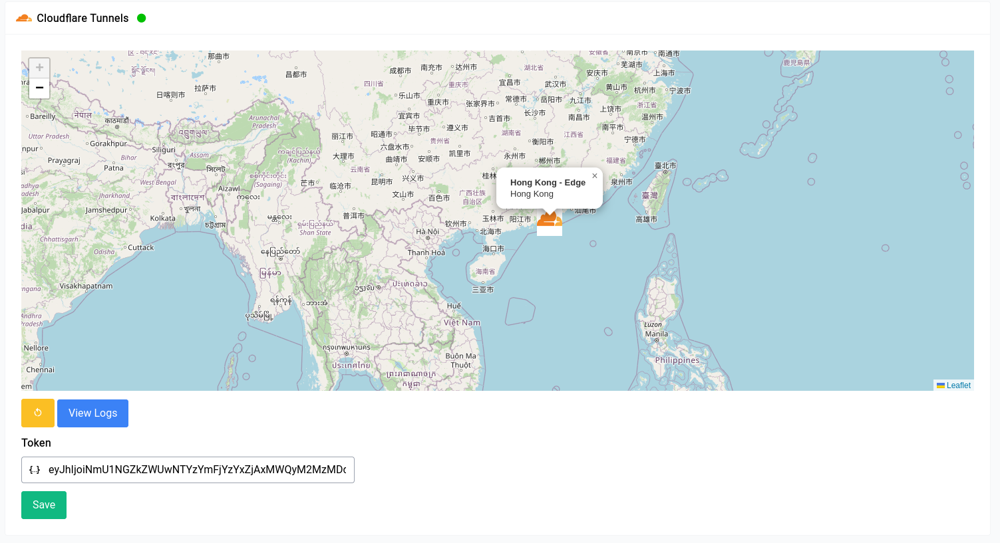

# Services - Cloudflare Tunnels

Cloudflare Tunnels is a service that allows you to expose your local services to the internet using [Cloudflare Argo Tunnels](https://developers.cloudflare.com/cloudflare-one/connections/connect-apps). It's a really good choice if you're behind a CGNAT or don't want to expose your IP address to the internet. This also provides protection via the cloudflare web application firewall (WAF).

## Enabling Cloudflare Tunnels

When you first visit this page you will be greeted with a green button which reads  “Enable Cloudflare Tunnel” you can click on that to enable Cloudflare Tunnels.

## Setup

Setting up a tunnel is dead simple, all you need to do is copy over your token that you got from your cloudflare dashboard into the textbox and hit save, that’s literally all there is to do. Every other configuration is done in the cloudflare dashboard itself.

You can use this really good [guide](https://developers.cloudflare.com/cloudflare-one/connections/connect-apps/install-and-setup/tunnel-guide/remote/) from cloudflare to set everything up. Once you set everything up, you should see something like the above with a map of your nearest edge nodes along with a green icon next to your title. If something doesn’t seem right you can always view the logs.