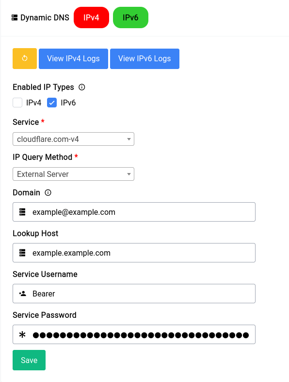

# Services - Dynamic DNS

Dynamic DNS is a service that allows you to point a domain name to your home network's public IP address. This is useful for accessing services hosted on your home network from the internet, or for accessing your router's web interface from anywhere.

Setting up the Dynamic DNS service is pretty straight forward. 

```admonish tip
We **highly** recommend that you use Cloudflare as your service provider as they’re really trustworthy and integrates with Difuse the best.
```

<center>
<a data-fancybox data-src="./img/22.png" data-caption="Services - Dynamic DNS - Setup">
  
</a>
</center>

In this typical configuration. We’re setting up an IPv6 only Dynamic DNS Service. It’s a really good idea to do only IPv6 if you have a **CGNAT** IP.

```admonish warning
You **need** to have an **A** and-or **AAAA** already configured with your nameserver provider else Dynamic DNS service will not work.
```

Let's go over the configuration options:

## Enabled IP Types

This option allows you to choose which IP types you want to use for your Dynamic DNS service. You can choose between IPv4, IPv6 or both. Please remember the note about CGNAT above.

## Service

Difuse offers over 70 different service providers for Dynamic DNS. You can choose the one that you prefer. 

## IP Query Method

This option allows you to choose how Difuse will get your public IP address. You can choose between:

- **Interface** - This option will get your public IP address from the interface that you choose. This is the recommended option.
- **External** - This option will get your public IP address from an external service. This is useful if you're behind a CGNAT or DHCP and don't have a public IP address on your router's WAN interface.

## Domain

You can enter in the domain or subdomain here, for cloudflare we need to specify (for a subdomain) with an `@` symbol. For example, if you want to use `example.example.com` you would enter `example@example.com` in the domain field.

This depends on your service provider so a little bit of trial and error might be needed. Usually the domain name or subdomain name just works as is.

## Lookup Host

This is the host that will be used to lookup your public IP address. This is usually just the plain domainname like `example.com` or `example.example.com`.

## Credentials

Now both the service username and password should be supplied by you that is specific to your configuration. In our case it’s the username Bearer and an API token for the password that looks something like this:

```
Bearer
VBpZTnM0NraVBpZTnM0NraVBpZTnM0NraVBpZTnM0Nra
```

Once everything is filled up you can just click on **Save** and you should be good to go.

If you want to restart the service you can just click on the yellow button with the restart symbol on it.