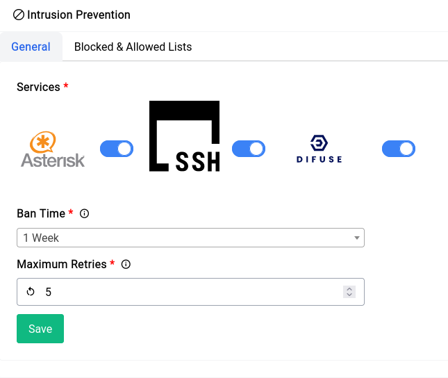
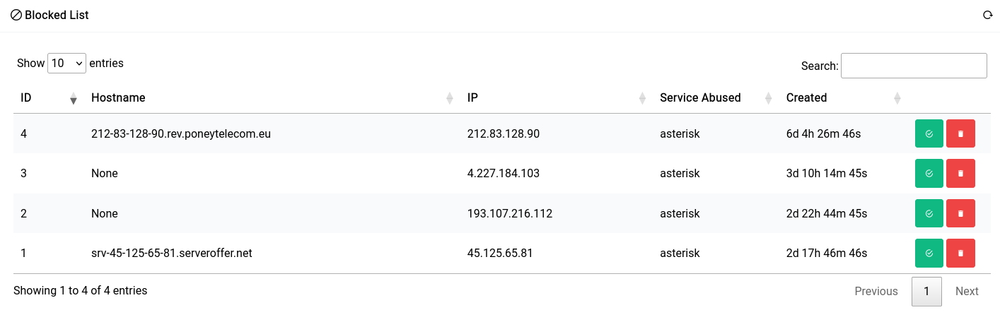
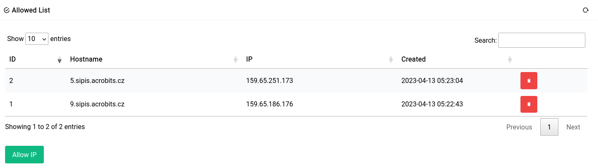
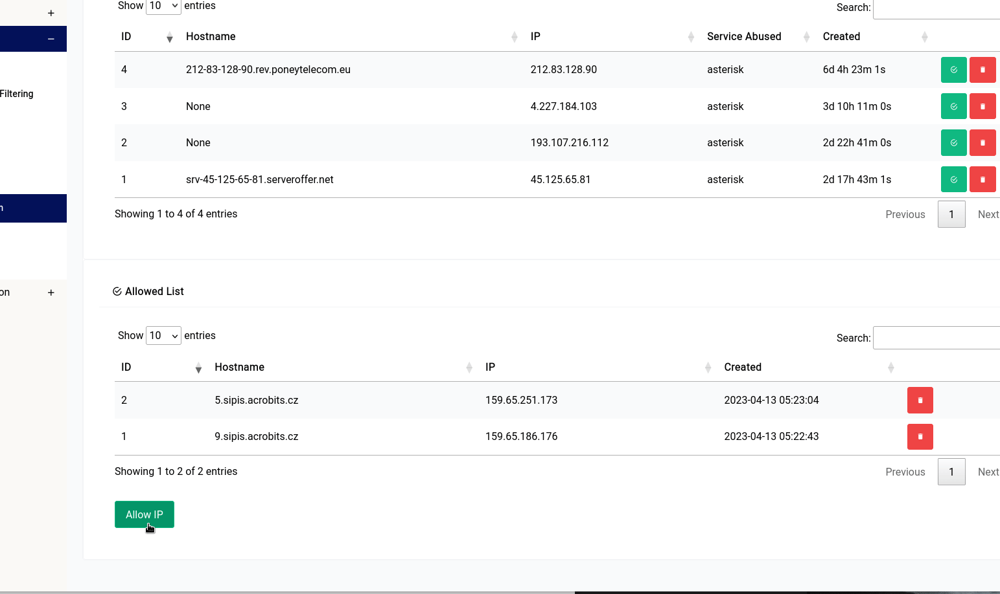

# Services - Intrusion Prevention

Our Intrusion Prevention system constantly monitors for authentication attempts that end in a failure and then ends up blocking the IP from accessing the entire network using firewall rules. It’s meant for 3 major services that are usually open to the internet:

- **SSH**
- **Asterisk**
- **Difuse GUI**

All these should have strong firewall rules in place already but just in case it’s fully open Intrusion Prevention should help mitigate some of the risk.

## General

<center>
<a data-fancybox data-src="./img/23.png" data-caption="Services - Intrusion Prevention - General">
  
</a>
</center>

In the general page you have 3 options:

- **Services Selected** - This option allows you to enable or disable the Intrusion Prevention system for specific services.
- **Ban Time** - This option allows you to set the ban time for the firewall rules that are created by the Intrusion Prevention system.
- **Maximum Retries** - This option allows you to set the maximum number of retries before the Intrusion Prevention system kicks in.


## Blocked & Allowed Lists

### Blocked List

In the blocked list, you can see peers that have already been caught and banned by the service:

<a data-fancybox data-src="./img/24.png" data-caption="Services - Intrusion Prevention - Blocked List">
  
</a>

If you’d like to whitelist (having them never be banned again) a particular peer you can click on the green icon, or if you want to delete them (so that they may be banned again) you can click on the red icon.

```admonish tip
Some **softphone** clients are good examples of false positives
```

### Allowed List

As you can see here we’ve whitelisted 2 acrobits servers from being banned as this kills their remote extension functionality. If you’re having trouble using your softphone client, it’s always a good idea to check the blocklist and whitelisting them.

<a data-fancybox data-src="./img/25.png" data-caption="Services - Intrusion Prevention - Allowed List">
  
</a>

If you’d like to manually white list a known peer, you can always click on the green button and type in an IP address like this:

<a data-fancybox data-src="./img/26.gif" data-caption="Services - Intrusion Prevention - Allowed List - Add IP">
  
</a>