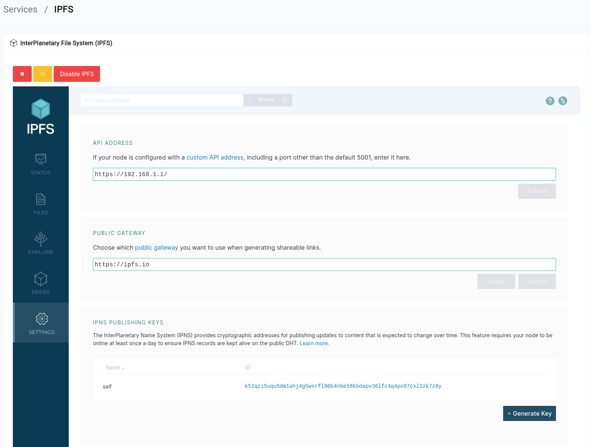
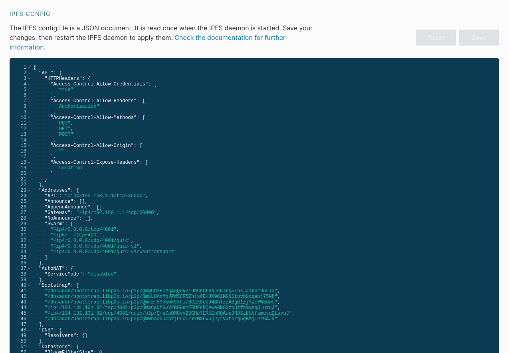
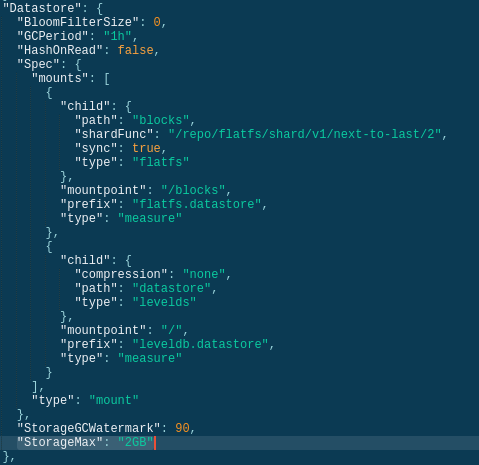

# Services - IPFS

IPFS is a peer-to-peer hypermedia protocol designed to make the web faster, safer, and more open. It enables the creation of completely distributed applications. It aims to make the web more open, distributed, and safer by connecting all computing devices with the same system of files.

```admonish warn
IPFS uses a lot of resources, RAM specifically. So if you have a heavy asterisk setup or a lot of devices on your network, it’s recommended to not enable IPFS.
```

## Enable IPFS

```admonish info
You need to have a mounted drive in order to enable IPFS. If you don’t have one, you can follow the guide [here](/services/storage.html).
```

When you first visit this page you will be greeted with a green button which reads **“Enable IPFS”** you can click on that to enable IPFS.

## Usage

You can use the **red** stop button to stop the IPFS service and the **yellow** restart button to restart the IPFS service.

IPFS runs on the following ports:

- **4001** - IPFS Swarm Port (used for P2P)
- **35000** - IPFS API Port
- **38000** - IPFS Gateway Port

### Using the IPFS Gateway

Let's say your router IP is `192.168.1.1` you can browse IPFS and IPNS websites by going to `http://192.168.1.1/ipfs/<hash>` or `http://192.168.1.1/ipns/<hash>` respectively.

### Using the API

You can use the API to interact with IPFS. You can find the API documentation [here](https://docs.ipfs.io/reference/http/api/). To access the web UI you can go to `http://192.168.1.1:35000/ipfs/bafybeiequgo72mrvuml56j4gk7crewig5bavumrrzhkqbim6b3s2yqi7ty/#/`

```admonish tip
Using the iframe embedded into the web UI is the easiest way to interact with IPFS, but sometimes large file uploads or downloads can fail. In that case you can use the API directly.
```

## Configuration

The IPFS configurations are all handled from the web UI itself, let's increase the maximum storage limit to 10GB as an example.

First we have to go to the settings page by clicking on the gear icon in the sidebar.

<a data-fancybox data-src="./img/27.png" data-caption="Services - IPFS - Settings">
  
</a>

Then we scroll down until we see the **IPFS CONFIG** section.

<a data-fancybox data-src="./img/28.png" data-caption="Services - IPFS - Settings">
  
</a>

Then we can change the **"Storage Max"** value to whatever we want in the **"Datastore"** property found here:

<a data-fancybox data-src="./img/29.png" data-caption="Services - IPFS - Settings">
  
</a>

You will need to restart the IPFS service for the changes to take effect.