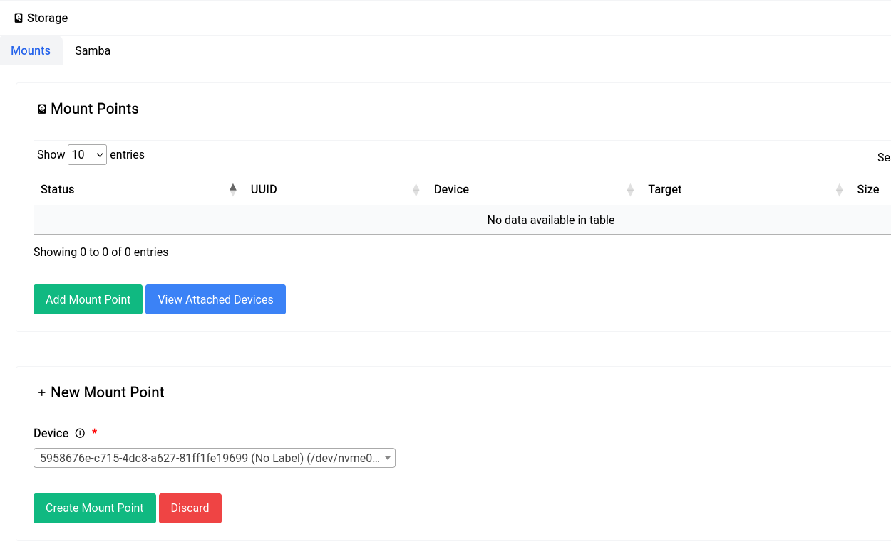
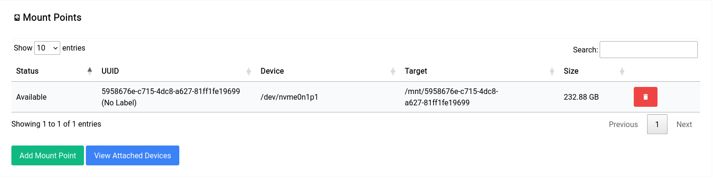
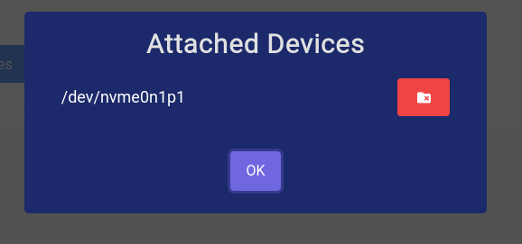
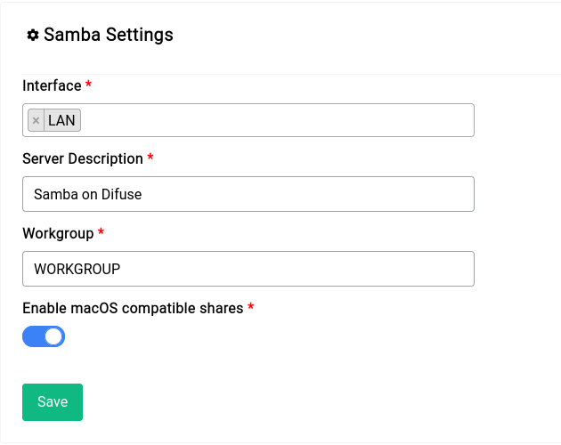
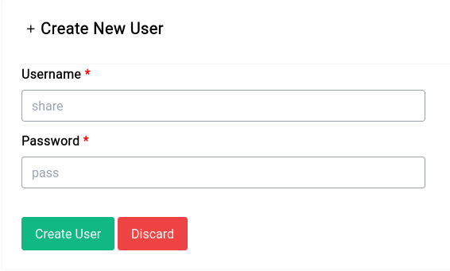
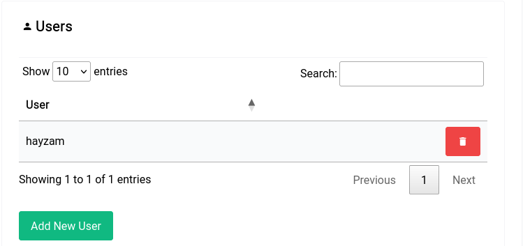
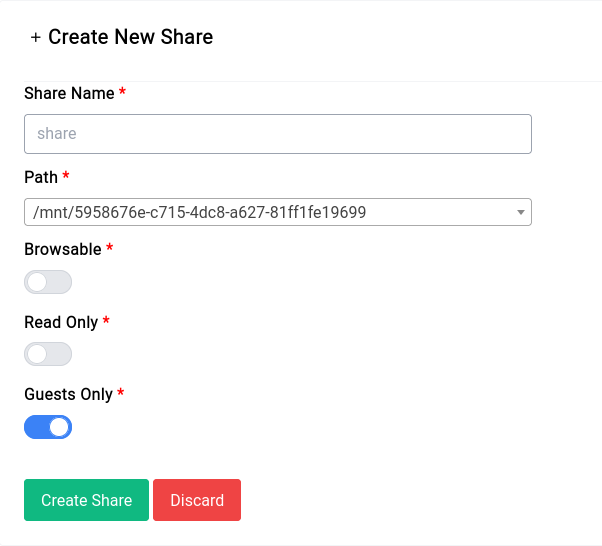
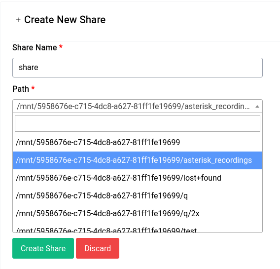
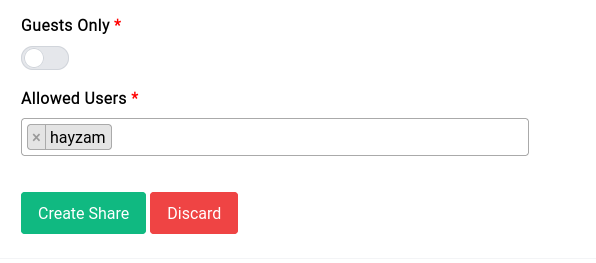
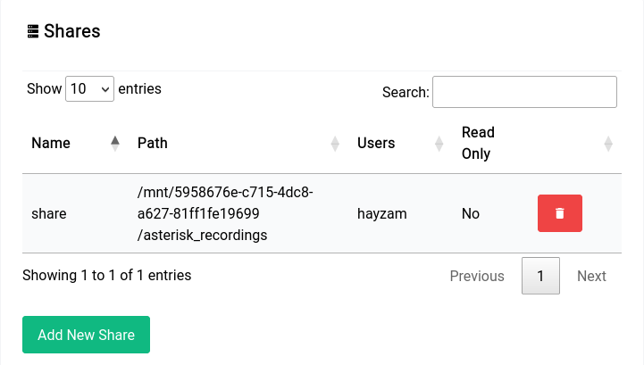

# Services - Storage

Storage is a service that allows you to create a NAS (Network Attached Storage) on your network. It uses [Samba](https://www.samba.org/) to provide SMB shares, you can mount USB drives or use the built-in storage (if you have a device with the M.2 SSD).

## Mounting Drives

Mounting a drive is simple, just click on **"Add Mount Point"** button and you should see a new form pop up, like this:

<a data-fancybox data-src="./img/12.png" data-caption="Services - Storage - Add Mount Point">
  
</a>

Once you click on the **"Create Mount Point"** button you should see the new mount point in the table, like this:

<a data-fancybox data-src="./img/13.png" data-caption="Services - Storage - Table">
  
</a>

## Deleting Mount Points

To delete a mount point, just click on the red delete button. Sometimes the delete doesn't go through completely since the drive might still be in use by Samba or some other service, in that case click on **"View Attached Devices"** and then click the delete button (red) next to the device you want to delete.

<center>
<a data-fancybox data-src="./img/14.png" data-caption="Services - Storage - View Attached Devices">
  
</a>
</center>

## Samba

### Settings

The underlying Samba server is fully configurable, you can change the workgroup, description, etc.

<center>
<a data-fancybox data-src="./img/15.png" data-caption="Services - Storage - Samba - Settings">
  
</a>
</center>

The interface you select is **crucial**, if you're using the WAN interface then you'll be exposing your shares to the internet, so make sure you know what you're doing.

### Shares
#### Samba Users

You can create Samba users by clicking on the **"Add New User"** button, you should see a new form pop up, like this:

<center>
<a data-fancybox data-src="./img/16.png" data-caption="Services - Storage - Samba - Add New User">
  
</a>
</center>


Once you click on the **"Create User"** button you should see the new user in the table, like this:

<a data-fancybox data-src="./img/17.png" data-caption="Services - Storage - Samba - Users Table">
  
</a>

You can add these users to every share you create.

#### Samba Shares

You can create Samba shares by clicking on the **"Add New Share"** button, you should see a new form pop up, like this:

<center>
<a data-fancybox data-src="./img/18.png" data-caption="Services - Storage - Samba - Add New Share">
  
</a>
</center>

Let's go over all the options:

##### Share Name

This is the name of the share, it will be visible to everyone on the network. When you're mounting the share you should specify this name. For example if you name the share `share` then you should mount it like this:

```
\\192.168.1.1\share
```

##### Path

This is the path to the folder you want to share, it can be the root of a drive or a folder inside a drive. In our case we've selected the asterisk_recordings directory like this:

<center>
<a data-fancybox data-src="./img/19.png" data-caption="Services - Storage - Samba - Path">
  
</a>
</center>

##### Browseable

This option allows you to hide the share from the network, if you set it to **off** then the share won't be visible to anyone on the network.

##### Read Only

This option allows you to make the share read only, if you set it to **on** then no one will be able to write to the share.

##### Guests Only

This option allows you to make the share only accessible to guests, if you set it to **on** then only guests will be able to access the share. If you turn it off you can see a new field appear with the users that you had created earlier, you can select the users that you want to give access to.

<center>
<a data-fancybox data-src="./img/20.png" data-caption="Services - Storage - Samba - Users">
  
</a>
</center>

Once you've entered in all the details and clicked on **"Create Share"** you should see the new share in the table, like this:

<center>
<a data-fancybox data-src="./img/21.png" data-caption="Services - Storage - Samba - Shares Table">
  
</a>
</center>